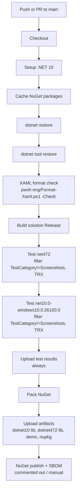

# Fluence.Wpf - Developer Handbook

Self-contained persistent memory for engineers (human and AI) working in this repository. Read top-to-bottom before touching code. This file is the single source of truth for conventions, architecture, reference authority, testing policy, and workflow; do **not** rely on out-of-repo agent bundles, external skill packs, or downstream-consumer-specific paths.

> **Portability rule** - everything in this handbook must remain usable by anyone consuming `Fluence.Wpf`, regardless of downstream product. Consumer-specific guidance (e.g. for a particular deployment toolkit) belongs in that consumer's own repo, not here.

---

## 1. Project overview

- **Fluence.Wpf** is a WPF control library that recreates the **Windows 11 Fluent / WinUI 3** visual language and interaction patterns on WPF.
- **Target frameworks** (library + tests): `net472` (primary) and `net10.0-windows10.0.26100.0`. Gallery demo (`Fluence.Wpf.Demo`) targets `net472` and `net10.0-windows10.0.26100.0`; MVVM demo (`Fluence.Wpf.Demo.Mvvm`) targets `net10.0-windows10.0.26100.0`.
- **Language**: `LangVersion=latest` across all TFMs, set centrally in `Directory.Build.props` - no per-TFM language restriction. `net472` still constrains **runtime API** availability (see [Section 4.3](#43-feasibility-test-for-net472)); avoid APIs that don't ship in `net472`, but C# language features themselves are not restricted. Nullable reference types are **enabled** (`Nullable=enable` in `Directory.Build.props`); individual projects may override with `<Nullable>disable</Nullable>` (e.g. `Fluence.Wpf.Demo.Mvvm`).
- **License**: BSD 3-Clause. Every `.cs` file begins with the same 27-line header; copy it verbatim from any existing library file when adding new sources. Do not edit the copyright year unless the user asks.
- **OS**: Windows 10 1809+ baseline. Mica and rounded-corner extras light up on Windows 11.
- **XML namespace URI**: `http://schemas.fluencewpf.com` - suggested prefix `fluence`.

### Solution layout

```text
Fluence.Wpf.sln
├── Fluence.Wpf/             Control library (multi-TFM: net472 + net10.0-windows10.0.26100.0)
├── Fluence.Wpf.Demo/        Gallery app (net472 + net10.0-windows10.0.26100.0) - visual verification for all controls
├── Fluence.Wpf.Demo.Mvvm/   MVVM Task Manager demo (net10.0-windows10.0.26100.0) - CommunityToolkit.Mvvm example
└── Fluence.Wpf.Tests/       MSTest 4.2.2 suite (multi-TFM)
```

### CLR namespaces

| Namespace                | Contents                                                                                                                                                                                                  |
| ------------------------ | --------------------------------------------------------------------------------------------------------------------------------------------------------------------------------------------------------- |
| `Fluence.Wpf`            | `ApplicationThemeManager`, `ApplicationAccentColorManager`, `SystemThemeWatcher`, `ThemeChangedEventArgs`, theme enums, control enums, and event args such as `TabViewTabCloseRequestedEventArgs`         |
| `Fluence.Wpf.Controls`   | Custom controls (`Button`, `TabView`, `Card`, `NavigationView`, etc.), `FluenceWindow`, `TitleBar`, `WindowPolicy`, layout controls, and navigation view family                                            |
| `Fluence.Wpf.Automation` | UI Automation peers for controls such as `NavigationView`, `ToggleSwitch`, `DropDownButton`, `SplitButton`, `NumberBox`, `InfoBar`, and `ProgressRing`                                                     |
| `Fluence.Wpf.Helpers`    | Internal helpers (`AcrylicNoiseHelper`, `BackdropPlan`, `FramePlan`, `GridLengthAnimation`, `HsvColorHelper`, `OsVersionHelper`, `RegistryHelper`, `WindowCapabilities`)                                  |
| `Fluence.Wpf.Native`     | P/Invoke constants, structs, and methods                                                                                                                                                                  |

XAML themes are under `Fluence.Wpf/Themes/` and are **not** a CLR namespace.

---

## 2. Coding standards

### File header (required)

Every `.cs` file in the library, demo, and tests starts with the BSD 3-Clause header used by any existing source file (e.g. `Fluence.Wpf/ApplicationThemeManager.cs` lines 1-27). Never delete, shorten, or paraphrase it.


### Language features

- Avoid em dash or en dash characters anywhere in documentation or comments.
- All TFMs use `LangVersion=latest` (set in `Directory.Build.props`). Use modern C# features freely; verify any runtime API is available in `net472` before using it.
- Do not guard blocks with `#if NET10_0_OR_GREATER` to gain runtime APIs not present in `net472`; instead apply [Section 4.3](#43-feasibility-test-for-net472) guidance.
- Nullable reference types are **enabled** (`Nullable=enable` in `Directory.Build.props`). Library and test code must be nullable-clean - annotate parameters and returns with `?` only where genuinely nullable.
- `public` API must have `///` XML doc comments. The library builds with `<DocumentationFile>` and does not suppress `CS1591` / `CS1574`; missing comments fail the build.
- **File encoding**: `.editorconfig` sets `charset = utf-8-bom` for all files. At minimum, all `.cs`, `.xaml`, `.csproj`, `.props`, `.targets`, and `.md` files must be saved as **UTF-8 with BOM** (EF BB BF). Never commit UTF-16 LE files - they produce spurious full-file diffs, break `grep`-based tooling, and may cause XML parser failures on some build agents. If your editor does not default to UTF-8 with BOM, configure it project-wide. Verify with `[System.IO.File]::ReadAllBytes($path)[0..2]` - must be `0xEF 0xBB 0xBF`.

### Warnings and analyzers

`Directory.Build.props` + `.editorconfig` harden the compiler to the maximum:

- **`TreatWarningsAsErrors=True`** and **`WarningLevel=9999`**: every diagnostic is a build error. Fix root cause; never suppress without an explicit entry.
- **`AnalysisLevel=latest-all`** + **`EnforceCodeStyleInBuild=true`**: all Roslyn analyzers and IDE style rules run as build-time errors across every project.
- **`CheckForOverflowUnderflow=True`**: arithmetic that overflows fails the build. Win32 bit-mask operations (HIWORD/LOWORD extractions from `lParam`) **must** be wrapped in `unchecked { }`. See `FluenceWindow.HitTestTitleBar` for the canonical pattern.
- **`Microsoft.CodeAnalysis.BannedApiAnalyzers`** (RS0030) reads `BannedSymbols.txt` at the solution root. **`string.IsNullOrEmpty()` is banned** - always use `string.IsNullOrWhiteSpace()`. Adding new banned symbols requires updating `BannedSymbols.txt`.
- **`Microsoft.Extensions.StaticAnalysis`** (SonarAnalyzer): Sxxx rules run as errors; see `.editorconfig` for the suppressed subset.

**Suppressions in `.editorconfig`** - do not re-enable without discussion:
- `IDE0056` / `IDE0057` - index/range operators (net472 runtime gap)
- `CA1307` / `CA1310` / `CA1847` / `CA1866` - string ordinal/span overloads (net472 API gap)
- SonarAnalyzer: `S103`, `S104`, `S107`, `S109`, `S1067`, `S1121`, `S1449`, `S1659`, `S3358`, `S3458`, `S3532`, `S3869`

**Per-library suppressions** (in `Fluence.Wpf.csproj` `<NoWarn>`):
- `SYSLIB1045` - regex source generator (not available on `net472`)
- `IDE0330` - `System.Threading.Lock` preference (not available on `net472`)
- `S1244` - floating-point equality (necessary for pixel math)
- `VSTHRD001` - task/thread analyzer (WPF dispatcher pattern conflict)

Prefer `EventArgs.Empty`, `nameof(...)`, explicit `readonly`, and immutable helpers. **Never** use inline `#pragma warning disable` except in exceptional third-party interop cases.

### C# style conventions

`EnforceCodeStyleInBuild=true` + `AnalysisLevel=latest-all` make the following patterns **mandatory** (violations are build errors):

- **Explicit types over `var`**: `Color customColor = ...` not `var customColor = ...`. Exception: anonymous types have no explicit form.
- **Target-typed `new()`**: `MainWindow mainWindow = new()` not `var mainWindow = new MainWindow()` - use when the type is clear from the declaration.
- **Discard ignored returns with `_`**: methods that return a value must have the return consumed or explicitly discarded. `_ = Dispatcher.BeginInvoke(...)`, `_ = list.ApplyTemplate()`.
- **`default` not `default(T)`**: `Assert.AreNotEqual(default, value)` not `Assert.AreNotEqual(default(Color), value)`.
- **`is not` for null pattern checks**: `if (x is not FrameworkElement fe) throw ...` instead of `x as T; if (x is null) throw ...`.
- **`??` throw expressions**: `FindVisualChildByName<T>(...) ?? throw new InvalidOperationException(...)` instead of a separate null-check + throw block.
- **`const` for compile-time-known locals**: `const FrameworkPropertyMetadataOptions flags = ...` when a local's value is statically determined.
- **Auto-properties over manual backing fields**: `public static Color SystemAccentColor { get; private set; }` instead of a `private static Color _systemAccentColor` field plus an expression-bodied getter.
- **Remove redundant `using` directives**: unused imports are `error` (IDE0005).

### Naming

- Dependency properties: `public static readonly DependencyProperty FooProperty = DependencyProperty.Register(...)` with a CLR wrapper `public T Foo { get; set; }` and, when relevant, `OnFooChanged` static callback.
- Readonly DPs end with `...PropertyKey` private field + public `...Property = ...PropertyKey.DependencyProperty`.
- Template parts: `const string PART_Whatever = "PART_Whatever"`; annotate the class with `[TemplatePart(Name = PART_..., Type = typeof(T))]`.
- Visual states: `[TemplateVisualState(GroupName = "CommonStates", Name = "Normal|PointerOver|Pressed|Disabled")]`.

### XAML

- Keep templates in `Fluence.Wpf/Themes/Controls/<ControlName>.xaml`, one file per control, merged from `Themes/Generic.xaml`.
- Use `DynamicResource` for any brush, color, corner radius, or typography value that must react to theme, accent, or high contrast at runtime.
- Use `StaticResource` only for immutable assets (glyphs, fixed icon paths, constant geometries).
- Never inline hard-coded hex colors in production templates; always go through a canonical WinUI-style key.
- Animation timings: **~100-167 ms** typical transitions (WinUI `ControlFastAnimationDuration`, `ControlNormalAnimationDuration`). Easing curves consistent with existing templates (`{StaticResource ControlFastOutSlowInKeySpline}` where present).
- Focus visual: default WPF focus rectangles off; use FluentControl focus brush tokens instead, as in the existing Button / Card templates.

#### XAML formatting (XAML Styler)

Authored XAML is formatted by **XAML Styler** against the committed reference style `Settings.XamlStyler` at the repo root. The tool is pinned in `.config/dotnet-tools.json` (`dotnet tool restore`), so formatting is reproducible and does not depend on any editor plugin.

- **Format** all authored XAML: `pwsh eng/Format-Xaml.ps1`. Format one file: `pwsh eng/Format-Xaml.ps1 -Path <file>`.
- **Check** (CI gate, non-destructive): `pwsh eng/Format-Xaml.ps1 -Check` - fails if any authored XAML is not conformant. Wired into `.github/workflows/build.yml` and run on every edit by `.claude/hooks/post-tool-format-xaml.ps1`.
- The reference style is attribute-per-line beyond two attributes (`AttributesTolerance: 2`), first attribute on a new line, 4-space indent. `eng/Format-Xaml.ps1` also enforces LF + a single UTF-8 BOM.
- **Generated XAML is excluded** from formatting and the check: `Fluence.Wpf/Properties/DesignTime.*.xaml` (emitted byte-for-byte by `DesignTimeResourceWriter`; reformatting would break the `DesignTimeResources_AreCurrent` drift guard) and `**/Resources/fluence-wpf-banner-*.xaml` (generated vector geometry). Do not run the formatter on these; update the exclusion list in `eng/Format-Xaml.ps1` if new generated XAML is added.
- Do not hand-fight the formatter: run it and commit its output. XAML Styler's own `-p` passive mode is unreliable (false positives), which is why the check formats a temp copy and compares.

---

## 3. Theme architecture

### Pipeline

The theme system is a single linear pipeline implemented in `Fluence.Wpf/Theming/FluenceThemeEngine.cs`. `ApplicationThemeManager` and `ApplicationAccentColorManager` are thin public facades that delegate to it; all color and brush computation lives in the engine.

```
Apply(themeRequest):
  1. theme   = ThemeResolver.Resolve(request)         // Light / Dark / HC from request + OS registry
  2. palette = AccentResolver.Resolve(accentIntent)   // OS palette first, generate fallback, default blue
  3. colors  = ColorMap.Build(theme, palette)         // one Dictionary<string,Color>:
                  per-theme Color tokens from Theme.*.xaml (Color-only XAML tables)
                  + the few theme-independent tokens (the Windows close-button brand
                    colors) seeded in code by BaseColorTables; Shared.xaml no longer exists
                  + all accent-derived keys computed once here
                  + title-bar colors (TitleBarActiveColor, TitleBarInactiveColor, WindowBorderColor)
  4. dict    = BrushFactory.Build(colors)             // one ResourceDictionary: every Color token
                  + a frozen SolidColorBrush twin (key + "Brush") for each; SpecialBrushes.Add adds
                  gradient elevation borders, HC SystemColors overrides, and brush-only exceptions
  5. publish -> replace MergedDictionaries[0] with dict; DynamicResource consumers re-resolve
  6. raise FluenceThemeEngine.Published -> facades fire Changed and AccentColorChanged
```

There is no key promotion, no swap-vs-mutate split, and no per-key copy-up into top-level `Application.Resources`. Every color and brush is built fresh and published as one dictionary replacement.

**Accent intent** is sticky and resolved on every Apply call. `AccentIntent.System` (the default) reads the full OS palette from the registry first; if that fails it falls back to the DWM colorization color and then to default blue. `Apply(theme)` alone uses the OS palette - there is no "must also call `ApplySystemAccent`" footgun. `ApplyCustomAccent(Color)` pins the ramp to the given color using the HSV generator; `ApplySystemAccent()` resets the intent to System.

**High contrast** is just another color table. Its tokens are resolved from live `SystemColors` in `SpecialBrushes.AddHighContrastBrushes`; there is no `_promotedHighContrastBrushKeys` list. A `WM_SETTINGCHANGE` via `SystemThemeWatcher` triggers a re-Apply, which rebuilds and republishes the HC brushes from the current `SystemColors` snapshot.

### Merge slots

After `ApplicationThemeManager.Apply(...)` has run, `Application.Current.Resources.MergedDictionaries` always contains exactly **three** dictionaries in this fixed order:

|  Slot | Dictionary                    | Lifecycle                                              |
| ----: | ----------------------------- | ------------------------------------------------------ |
| `[0]` | Computed colors + brushes     | **Replaced** on every theme or accent change           |
| `[1]` | `Themes/Typography/Typography.xaml` | Loaded once; never replaced                      |
| `[2]` | `Themes/Generic.xaml`         | Loaded once; never replaced                            |

Slot `[0]` is the `ResourceDictionary` built by `FluenceThemeEngine.BuildComputedDictionary` each Apply. It holds every canonical Color token and its frozen `SolidColorBrush` twin, plus special brushes (elevation gradients, HC overrides, brush-only exceptions). Replacing it causes all `DynamicResource` bindings in control templates to re-resolve without any promotion step.

The slot layout is enforced by `DictionaryStabilityTests` - any change to count or ordering must be accompanied by a conscious update to both sides. The per-theme XAML files (`Themes/Colors/Theme.*.xaml`) are Color-only tables read by `BaseColorTables` at pipeline step 3; `Brushes.xaml` and `Accent.xaml` no longer exist.

### Canonical color/brush keys

Names align with WinUI 3. Families currently used:

- **Text**: `TextFillColorPrimary|Secondary|Tertiary|Disabled` (+ `Brush` suffix).
- **Accent text**: `AccentTextFillColorPrimary|Secondary|Tertiary|Disabled`.
- **Control fill**: `ControlFillColorDefault|Secondary|Tertiary|Disabled|InputActive|Transparent`.
- **Control stroke**: `ControlStrokeColorDefault|Secondary|OnAccentDefault|OnAccentSecondary|OnAccentTertiary|OnAccentDisabled`.
- **Strong stroke** (ring-style selection / focus): `ControlStrongStrokeColorDefault|Disabled`.
- **Card**: `CardBackgroundFillColorDefault|Secondary`, `CardStrokeColorDefault|DefaultSolid`.
- **Background / layer**: `SolidBackgroundFillColorBase|Secondary|Tertiary|Quarternary`, `LayerFillColorDefault|Alt`.
- **Accent fill**: `AccentFillColorDefault|Secondary|Tertiary|Disabled|SelectedTextBackground`.
- **System**: `SystemFillColorSuccess|Caution|Critical|Neutral|NeutralBackground|SolidNeutral|SolidAttentionBackground`.
- **Accent ramp**: `SystemAccentColor`, `SystemAccentColorPrimary|Secondary|Tertiary`, and matching `*Brush` pairs.

Every color key generally has a sibling `*Brush` `SolidColorBrush`; template bindings almost always target the `Brush` version via `DynamicResource`.

### Theme API surface

- `ApplicationThemeManager.Apply(ApplicationTheme theme, BackdropType backdrop = BackdropType.Auto, bool updateAccent = true)` - first call seeds all three slots; later calls replace `[0]` with a freshly built computed dictionary. `updateAccent` is accepted for signature compatibility but no longer branches behavior.
- `ApplicationThemeManager.CurrentTheme` / `CurrentBackdrop` - read-only state.
- `ApplicationThemeManager.Changed` - `EventHandler<ThemeChangedEventArgs>`, raised once per applied change.
- `ApplicationAccentColorManager.ApplySystemAccent()` / `ApplyApplicationAccent(Color)` / `ApplyCustomAccent(Color)` - set the accent intent and re-run the full pipeline. Subscribe to `AccentColorChanged` for post-apply hooks.
- `SystemThemeWatcher.Watch(Window)` / `UnWatch(Window)` - Win32 settings-change hooks with debounce; fires `Changed` (via `ApplicationThemeManager`) once per logical OS change. **Do not assume more than one `Changed` per user action in tests.**
- `FluenceWindow` is the canonical WPF window with DWM backdrop, rounded corners, caption extension, and an optional title-bar content slot.

---

## 4. Reference priority

When a question arises about _"how should this look, behave, or be implemented?"_ - resolve it in this order. Never fabricate Fluent semantics from imagination; always cite an authoritative source.

### 4.1 General priority (applies to every question)

1. **In-tree precedent.** If a pattern already exists in `Fluence.Wpf/Themes/**/*.xaml`, `Fluence.Wpf/Controls/*.cs`, or `Fluence.Wpf.Tests/ThemeTestHelpers.cs`, follow it. Consistency with the shipped surface trumps outside sources.
2. **Per-domain reference (see [Section 4.2](#42-per-domain-authority)).** Select the correct authority for the concern at hand.
3. **Published Windows 11 design guidance** on Microsoft Learn (Fluent Design docs, Windows App SDK docs). Use as a tie-breaker only, never as the primary spec.

Undocumented "looks right" choices are not acceptable in a PR. If nothing in the three layers above covers a specific case, raise it and get explicit guidance before implementing.

### 4.2 Per-domain authority

| Concern                                                                           | Primary authority                                                                                                                                                                                                                                     | Rationale                                                                            |
| --------------------------------------------------------------------------------- | ----------------------------------------------------------------------------------------------------------------------------------------------------------------------------------------------------------------------------------------------------- | ------------------------------------------------------------------------------------ |
| Visual tokens (colors, brushes, typography, spacing, corner radii, timing curves) | [**WinUI 3 CommonStyles**](https://github.com/microsoft/microsoft-ui-xaml/tree/main/src/controls/dev/CommonStyles)                                                                                                                                    | Canonical Microsoft-owned Fluent design tokens and control visuals.                  |
| WPF-native window chrome (`WindowChrome`, DWM extension, caption buttons)         | [**.NET 10 WPF Themes**](https://github.com/dotnet/wpf/tree/main/src/Microsoft.DotNet.Wpf/src/Themes)                                                                                                                                                 | WPF-specific idioms that WinUI 3 does not express; known to work on `net472`.        |
| Navigation patterns (`NavigationView` layout, selection indicator, pane modes)    | [**WinUI 3 CommonStyles**](https://github.com/microsoft/microsoft-ui-xaml/tree/main/src/controls/dev/CommonStyles) (visual) + [**.NET 10 WPF Themes**](https://github.com/dotnet/wpf/tree/main/src/Microsoft.DotNet.Wpf/src/Themes) (WPF translation) | Visuals are Fluent-canonical; composition must respect WPF templating constraints.   |
| Accent ramp generation and HSV tint math                                          | [**.NET 10 WPF Themes**](https://github.com/dotnet/wpf/tree/main/src/Microsoft.DotNet.Wpf/src/Themes)                                                                                                                                                 | Includes a proven WPF implementation of the Windows accent ramp.                     |
| System theme detection (Light/Dark/HighContrast)                                  | [**.NET 10 WPF Themes**](https://github.com/dotnet/wpf/tree/main/src/Microsoft.DotNet.Wpf/src/Themes)                                                                                                                                                 | WPF-compatible registry reads and `WM_SETTINGCHANGE` handling suitable for `net472`. |
| Individual controls (Button, CheckBox, RadioButton, ComboBox, ToggleSwitch, etc.) | [**WinUI 3 CommonStyles**](https://github.com/microsoft/microsoft-ui-xaml/tree/main/src/controls/dev/CommonStyles)                                                                                                                                    | Canonical Fluent templates and visual states.                                        |
| Acrylic / Mica backdrops, rounded corners                                         | [**.NET 10 WPF Themes**](https://github.com/dotnet/wpf/tree/main/src/Microsoft.DotNet.Wpf/src/Themes) + [DWM API docs on Microsoft Learn](https://learn.microsoft.com/windows/win32/api/dwmapi/)                                                      | DWM interop is the mechanism; .NET 10 WPF demonstrates the WPF hook.                 |
| Accessibility / automation peers                                                  | WinUI 3 CommonStyles + Windows UI Automation docs on Microsoft Learn                                                                                                                                                                                  | Behavioural contract, not visual.                                                    |

### 4.3 Feasibility test for `net472`

When a reference pattern depends on an API that is not available on `net472` (CsWinRT, WinUI runtime types, `System.Text.Json` source generators, etc.):

1. **Prefer** the closest idiomatic WPF translation using `System.Windows.*` primitives - this is why .NET 10 WPF is listed as the primary authority for WPF-native concerns.
2. **Document** the gap in `KNOWN_ISSUES.md` with the specific API that is unavailable and what the chosen fallback gives up; create the file first if this is the branch's first accepted known issue.
3. **Never** add a new third-party runtime dependency to close a `net472` gap without explicit user approval.

---

## 5. Control authoring checklist

When adding a new control or materially changing an existing one:

1. **CLR type**
   - Subclass the closest `System.Windows.Controls.*` (or `Control` / `ContentControl`).
   - In the static constructor: `DefaultStyleKeyProperty.OverrideMetadata(typeof(MyControl), new FrameworkPropertyMetadata(typeof(MyControl)));`.
   - Expose dependency properties; use `RegisterReadOnly` for state-only DPs (`IsPressed`, `IsValid`).
2. **Template**
   - Add `Themes/Controls/MyControl.xaml` as a standalone `ResourceDictionary` and merge it from `Themes/Generic.xaml`.
   - Mark template parts with `[TemplatePart]` attributes and wire them in `OnApplyTemplate`.
   - Wire up `VisualStateManager` groups (`CommonStates`, `FocusStates`, `CheckStates`, etc.) with Fluent timings (~100-167 ms).
3. **Resources**
   - Reuse canonical WinUI keys. If a concept is new (e.g. a brand-specific state), add a **color** to each `Themes/Colors/Theme.*.xaml` (Color-only XAML tables), then add the brush to `SpecialBrushes.cs` if it requires a non-standard twin name or a gradient, or rely on the auto-twin that `BrushFactory` emits for every Color key. `Brushes.xaml` no longer exists.
   - Add a design-time preview entry in `Fluence.Wpf/Properties/DesignTimeResources.xaml` assuming Light + `#0078D4`; add the demo counterpart only when the demo also needs designer-time resource resolution.
4. **Demo**
   - Add or extend a gallery page under `Fluence.Wpf.Demo/Pages/Gallery*.xaml`. Register the page in `MainWindow.NavigateTo(string tag)` if it should be navigable from the `NavigationView`.
5. **Tests (mandatory)**
   - Add a partial `ControlTests.MyArea.cs` in `Fluence.Wpf.Tests`. Use `RunOnStaThread`, `EnsureApplication`, `MergeGenericDictionary`, and `FindVisualChild*` helpers.
   - Cover at minimum: default style applies, key template parts found, critical DP/state transitions, and (if theme-sensitive) one theme cycle via `ThemeTestHelpers.ApplyStandardThemeCycle`.
6. **Docs**
   - Append to `docs/controls.md` when the public catalogue changes.
   - Note new brush families in `docs/theming.md`.
   - Add a one-line entry under the current CHANGELOG section.

---

## 6. Testing

- **Framework**: MSTest 4.2.2 (`MSTest.TestFramework` / `MSTest.TestAdapter`) via `Microsoft.NET.Test.Sdk` 17.9.0.
- **TFMs**: `net472` **and** `net10.0-windows10.0.26100.0`; both must pass.
- **Parallelization**: `[assembly: DoNotParallelize]` lives in `Fluence.Wpf.Tests/Properties/AssemblyInfo.cs`, and the test project sets `<TestTfmsInParallel>false</TestTfmsInParallel>`. WPF's shared `ResourceDictionary` / storyboard sealing is not thread-safe across parallel fixtures or target-framework lanes.
- **STA**: `WpfTestSta` in the test project owns a single STA thread + `Dispatcher`. All UI-touching work goes through `WpfTestSta.Invoke(...)` / `RunOnStaThread(...)`.
- **Shared test helpers** live in `WpfTestSta` (single canonical copy): `RunOnSta` (STA invoke with `ExceptionDispatchInfo` rethrow), `DrainDispatcher` (`ApplicationIdle` pump), and two explicitly named tree walkers - `FindVisualDescendants<T>` (visual tree only) and `FindLogicalAndVisualDescendants<T>` (visual + logical, cycle-guarded). Per-fixture wrappers forward to these; do not reintroduce divergent copies. Prefer the condition-based `WaitUntil(dispatcher, timeoutMs, predicate)` (sampling the value you assert) over a fixed `WaitForAnimationAndDrain(ms)` delay.
- **Application**: `WpfTestSta.EnsureApplication()` creates an `Application` with `ShutdownMode.OnExplicitShutdown` so tests do not tear it down.
- **Theme helpers**: `ThemeTestHelpers.ApplyStandardThemeCycle` (Light -> Dark -> HighContrast -> Light); `AssertKeyThemeBrushesResolve` for canonical key sanity.
- **Tests for controls** typically:
  1. Merge `Themes/Generic.xaml` via `MergeGenericDictionary(Application.Current.Resources)` (this also calls `Apply(Light)` to seed canonical keys).
  2. Create a minimal `Window`, attach the control, call `Window.Show()` so `ApplyTemplate` runs.
  3. Drive the control (simulate mouse/keyboard by invoking protected `OnMouse*` members via a small probe subclass if needed; see `ClickableCardProbe` in `ControlTests.FluentStroke.cs`).
  4. Assert via `VisualTreeHelper` / `FindVisualChildByName` and `TryFindResource`.
  5. Drain the dispatcher with `DrainDispatcher()` and close the window.
- **InternalsVisibleTo**: the test assembly sees library internals; theme tests can call `ApplicationThemeManager.ResetForTesting()` to isolate fixtures.
- **Baseline policy**: the HEAD-of-branch test count is the floor. Add tests, do not weaken it. If a test is legitimately obsoleted by a design change, remove the whole file in the same commit that supersedes it, record the rationale in `CHANGELOG.md`, and update this handbook if the testing pattern itself changed.
- **Known pre-existing failures**: a root `KNOWN_ISSUES.md` exists; it tracks deliberate non-features and resolved follow-ups, not accepted test failures. If a failing test is ever accepted instead of fixed, record it there with the reproduction, affected TFM, reason, owner, and intended fix. A green local run is `total - skipped - known-failures = passed`; do not merge if your own changes add to the known-failure count.
- **Screenshot harness**: `Fluence.Wpf.Tests/GalleryScreenshotHarness.cs` regenerates `docs/screenshots/banner-{theme}-{scale}x.png` via `RenderTargetBitmap` during normal full test runs. DWM backdrops (Mica / Acrylic) are _not_ captured by `RenderTargetBitmap`, so the harness hosts `GalleryHomePage` inside a plain `Window` with a solid `SolidBackgroundFillColorBaseBrush`.

---

## 7. Build and run

```powershell
# from repo root
dotnet restore Fluence.Wpf.sln
dotnet build   Fluence.Wpf.sln -c Debug
dotnet test    Fluence.Wpf.Tests/Fluence.Wpf.Tests.csproj -c Debug -f net472 --no-build
dotnet test    Fluence.Wpf.Tests/Fluence.Wpf.Tests.csproj -c Debug -f net10.0-windows10.0.26100.0 --no-build
```

- Zero errors, zero warnings - the library is `TreatWarningsAsErrors`.
- CI uses the same matrix in Release configuration, with separate `net472` and `net10.0-windows10.0.26100.0` test steps and TRX output. Keep local validation split by TFM unless there is a specific reason to run the combined multi-target command.
- The gallery demo is run with `dotnet run --project Fluence.Wpf.Demo/Fluence.Wpf.Demo.csproj -f net472` or the matching `net10.0-windows10.0.26100.0` TFM.
- For visual verification: exercise Light / Dark / High Contrast / Auto, a couple of accent swatches, Mica / Acrylic / Tabbed / None backdrops, and at least one control per gallery page.

### CI/CD pipeline

CI is a single `build` job on `windows-latest` defined in [.github/workflows/build.yml](.github/workflows/build.yml), triggered by any push or pull request targeting `main`. It restores, gates XAML formatting, builds Release, runs both TFM test lanes (excluding the `Screenshots` category) with TRX output, then packs and uploads artifacts. NuGet publish and SBOM generation are present but commented out as deliberate manual release steps.



---

## 8. Demo applications

### Fluence.Wpf.Demo (gallery, net472 + net10.0-windows10.0.26100.0)

- `MainWindow` is a `FluenceWindow` with `ExtendsContentIntoTitleBar="False"` in source, `SystemBackdropType="Mica"`, and a custom `TitleBar` slot hosting the app icon, title, a `TextBox` **search** bound to filter menu items, and caption buttons.
- `NavigationView` named `DemoNav`: default `PaneDisplayMode="Left"` in source and opens expanded with `IsPaneOpen="True"` to showcase the full pane.
- Menu items carry `Tag` strings; `MainWindow.NavigateTo(string tag)` does a switch to the matching `Gallery*Page` inside the content frame. Navigation remains tag-driven, with a lightweight visited-page stack only for the shell Back button.
- `GalleryHomePage` shows a theme-aware hero banner (`BannerLight.png` / `BannerDark.png`) and large **clickable `Card`** tiles that route through the same `NavigateTo` helper. Window controls and app-level theme/navigation/backdrop options live on the Settings page.
- 17 navigation-catalog pages: Home, Colors, Icons, Typography, Buttons, Selection, Inputs, Forms, Data, Data binding, Trees, Menus, Navigation, Tabs, Layout, Status, and Accessibility. Settings is a `NavigationView.FooterMenuItems` entry (a real, selectable footer nav item with the shared selection indicator), not a `DemoNavigationCatalog` item; footer navigation is routed through `DemoNav.ItemInvoked`.
- Run: `dotnet run --project Fluence.Wpf.Demo/Fluence.Wpf.Demo.csproj -f net472` or `dotnet run --project Fluence.Wpf.Demo/Fluence.Wpf.Demo.csproj -f net10.0-windows10.0.26100.0`.

### Fluence.Wpf.Demo.Mvvm (MVVM Task Manager, net10.0-windows10.0.26100.0)

- Minimal Task Manager demonstrating `FluenceWindow` + Fluence controls with no interaction logic in code-behind. `MainWindow.xaml.cs` only sets `DataContext` and calls `InitializeComponent`; app startup remains in `App.xaml.cs`.
- Uses **CommunityToolkit.Mvvm** 8.4: `[ObservableProperty]`, `[RelayCommand(CanExecute=nameof(CanAdd))]`, `partial void OnXxxChanged` source-generated callbacks.
- `MainViewModel` owns an unfiltered `ObservableCollection<TaskItemViewModel>` and rebuilds `DisplayedTasks` on every filter or completion change. `StatusText` and `ProgressValue` are derived and notified after the rebuild - do **not** add `[NotifyPropertyChangedFor]` on `_activeFilter`; that would fire notifications before `DisplayedTasks` is rebuilt (stale read).
- Filter radio buttons use `EnumToBoolConverter` with `ConverterParameter={x:Static vm:FilterMode.*}`.
- Delete button inside `DataTemplate` reaches `MainViewModel.DeleteCommand` via `RelativeSource AncestorType=Window`; this is deliberate - keeps `TaskItemViewModel` free of parent references.
- `App.xaml` contains **no `MergedDictionaries`**; `ApplicationThemeManager.Apply` (called from `App.xaml.cs`) seeds all three slots ([0] computed, [1] Typography, [2] Generic). A manual `Generic.xaml` merge would become a fourth stale entry and corrupt slot indices.
- Run: `dotnet run --project Fluence.Wpf.Demo.Mvvm/Fluence.Wpf.Demo.Mvvm.csproj`.

---

## 9. Common pitfalls

- **`StaticResource` on a theme- or accent-bound brush** -> stale colors after the first theme switch. Fix: change to `DynamicResource`.
- **Clearing `Application.Current.Resources.MergedDictionaries`** directly, then adding your own, without going through `ApplicationThemeManager.Apply` -> broken `DynamicResource` chains and missing templates. Fix: always go through the manager; the first call initializes all slots.
- **Creating `FrameworkElement` instances on a worker thread** in tests -> `InvalidOperationException`. Fix: route through `WpfTestSta.Invoke`.
- **Skipping `[assembly: DoNotParallelize]`** on a new test project / renaming the assembly-info entry -> intermittent `ResourceReferenceExpression` / sealed-storyboard failures.
- **Assuming the old "subtle stroke" for selection rings** -> RadioButton / CheckBox rings disappear in light theme. Fix: use `ControlStrongStrokeColorDefaultBrush` (and `ControlStrongStrokeColorDisabledBrush` for disabled state).
- **Hard-coding caption metrics or backdrop flags in child controls** -> breaks on Windows 10 / unsupported DWM builds. Fix: read `OsVersionHelper` and honour `FluenceWindow` policy.
- **Replacing the demo's tag navigation with an external navigation service** -> divergence with the current `NavigateTo` contract. Keep routes tag-driven; the only stack is the lightweight shell Back history in `MainWindow`.
- **Holding designer-only brushes as immutable resources** -> designer no longer matches runtime after a theme change. Fix: keep `Properties/DesignTimeResources.xaml` minimal and aligned with Light + `#0078D4`.
- **Relying on a previous test's theme state leaking into yours** -> intermittent color-alpha mismatches when tests run as a suite but pass in isolation. Fix: always call `MergeGenericDictionary(Application.Current)` (which resets managers, clears dictionaries, and applies a known theme) as the first step of any control test body.
- **Using `string.IsNullOrEmpty()`** -> build error RS0030 (banned via `BannedApiAnalyzers` + `BannedSymbols.txt`). Fix: always use `string.IsNullOrWhiteSpace()`.
- **Win32 bit-mask arithmetic without `unchecked`** -> `OverflowException` at runtime; caught as a build error because `CheckForOverflowUnderflow=True`. Fix: wrap HIWORD/LOWORD extractions in `unchecked { }`. See `FluenceWindow.HitTestTitleBar` for the canonical pattern.
- **Ignoring a return value from a non-void method** -> build error CA1806. Fix: discard with `_ = method()`.
- **Immersive dark-mode DWM attribute differs by OS build** -> applying attribute 20 (`DWMWA_USE_IMMERSIVE_DARK_MODE`) on Windows 10 builds 17763-18361 (1809) silently fails and the caption stays light; those builds require attribute 19. Fix: select via `NativeMethods.GetImmersiveDarkModeAttribute(OsVersionHelper.OsBuild)` (the 19-vs-20 threshold is build 18362 / Windows 10 1903).
- **Auto-hide taskbar hidden under a maximized window** -> an auto-hide taskbar reports a work area equal to the full monitor, so a maximized custom-chromed window covers it and blocks the hover-reveal. Fix: in `WM_GETMINMAXINFO`, when `rcWork == rcMonitor`, shift the maximized rect 2 px on the auto-hide edge via `NativeMethods.GetAutoHideTaskbarEdge` + `ApplyAutoHideTaskbarShift`.
- **Subscribing static managers in a Window constructor leaks** -> `ApplicationThemeManager.Changed` and `ApplicationAccentColorManager.AccentColorChanged` are static, so subscribing in the constructor pins every constructed-but-never-shown `FluenceWindow` to their invocation lists forever. Fix: subscribe in `OnSourceInitialized` and unsubscribe in `OnClosed` so the lifetimes match.
- **Setting only `Window.Background` transparent for a DWM backdrop, leaving the HWND redirection surface black** -> a top-level WPF window has two background layers, and `HwndTarget.BackgroundColor` (the redirection surface WPF clears behind the content) defaults to opaque black. With an active backdrop the content `Background` is transparent, so the default-black redirection surface flashes before the system backdrop composites (the first-paint "black flash"), and it is worst under forced software rendering where the gap is widest. Fix: in `ApplyBackdrop`, set `HwndSource.CompositionTarget.BackgroundColor` to the same color as `Window.Background` (transparent for an active backdrop, the opaque theme fallback for `None`). This is why `FluenceWindow` needs no `DWMWA_CLOAK` first-paint guard - a cloak whose uncloak rides WPF-side signals (`ContentRendered` / `ContextIdle`) races the DWM composite and reintroduces the flash.

---

## 10. Documentation map

Public and repository documentation:

- [README.md](README.md)
- [CHANGELOG.md](CHANGELOG.md)
- [CONTRIBUTING.md](CONTRIBUTING.md)
- [SUPPORT.md](SUPPORT.md)
- [SECURITY.md](SECURITY.md)
- [docs/getting-started.md](docs/getting-started.md)
- [docs/theming.md](docs/theming.md)
- [docs/controls.md](docs/controls.md)
- [docs/powershell.md](docs/powershell.md)
- [docs/migration-guide.md](docs/migration-guide.md)
- [docs/contributing.md](docs/contributing.md)
- [docs/release.md](docs/release.md)
- [docs/templated-prompts.md](docs/templated-prompts.md) - canonical task templates (referenced from Section 13)
- [docs/demo-sample-pages.md](docs/demo-sample-pages.md) - demo sample-page standard (referenced from Section 14)
- [KNOWN_ISSUES.md](KNOWN_ISSUES.md)

Maintainer / AI context (this file and its siblings):

- [AGENTS.md](AGENTS.md) - this handbook
- [CLAUDE.md](CLAUDE.md) - pointer to this handbook for Claude-class assistants
- [.github/PULL_REQUEST_TEMPLATE.md](.github/PULL_REQUEST_TEMPLATE.md) - PR checklist shown to contributors
- [.github/workflows/build.yml](.github/workflows/build.yml) - Release build, split-TFM tests, package artifacts

Anything under `docs/_internal/` is not part of the public doc set. Do not link it from `README.md` or `docs/*.md`.

---

## 11. Role definition and quality gates

When you are editing this repository, you are acting as a **senior C#/.NET WPF engineer and Windows-theme specialist**. Every change must honour the following gates:

1. **Standards respected**: BSD header, `LangVersion=latest` with nullable-clean code, XML docs on public API, `DynamicResource` for theme-bound values, no hard-coded RGB, canonical WinUI key names, no banned APIs (`string.IsNullOrEmpty` etc.).
2. **Reference authority followed**: any visual or behavioural decision is backed by [Section 4](#4-reference-priority) (in-tree precedent -> per-domain authority -> Windows 11 docs). Fabricated design choices do not pass review.
3. **Build clean**: `dotnet build Fluence.Wpf.sln -c Debug` with **zero** errors and **zero** warnings after your change on every TFM; Release must also remain clean for release and CI work.
4. **Tests green, and extended**: split `dotnet test Fluence.Wpf.Tests/Fluence.Wpf.Tests.csproj -c Debug -f net472 --no-build` and `dotnet test Fluence.Wpf.Tests/Fluence.Wpf.Tests.csproj -c Debug -f net10.0-windows10.0.26100.0 --no-build` pass; every new control, public API, or behaviour change ships with an MSTest that exercises it, including a theme cycle where relevant. No regressions against the HEAD-of-branch baseline (see [Section 6](#6-testing)).
5. **Visual parity**: any template / XAML change is confirmed in `Fluence.Wpf.Demo` across Light, Dark, High Contrast, accent swap, and at least one backdrop. Capture screenshots (100% and 150% DPI) when visuals change materially.
6. **Docs synced**: public changes update `CHANGELOG.md`, and any of `README.md` / `docs/controls.md` / `docs/theming.md` that a consumer would rely on.
7. **Scope discipline**: do not touch unrelated files or rename things unless explicitly asked; do not commit without the user's explicit request.

### Consumer build compatibility

`Fluence.Wpf` has adopted the stricter consumer build requirements used by PSADT for release gating: warnings as errors, `latest-all` analyzers, code style enforcement, banned APIs, XML documentation generation, and the `net472` plus `net10.0-windows10.0.26100.0` build matrix. Treat the stricter consumer policy as authoritative for release conformance. If this repo drifts from it, correct the drift unless an exception is explicit, documented in this handbook or the affected project file, and approved by the user.

Consumer build compatibility is a release gate. For build-policy, public API, project metadata, resource-copy, or packaging changes that can affect downstream consumption, verify the standalone Fluence build and the current release-gate consumer build. PSADT-specific paths or build artifacts may be cited only as release-gate evidence; do not make this handbook depend on consumer-local layout.

---

## 12. Exclusions (apply to _this_ handbook)

- No filesystem paths, build steps, or deployment artifacts specific to a downstream consumer product, except concise release-gate evidence when validating consumer build compatibility.
- No endorsement of, or dependency on, any particular third-party WPF library; keep comparisons, migration notes, and naming advice generic.
- No references to external agent bundles, skill packs, or remote tooling that are not already part of this repository.
- No speculative roadmap items; everything in this file must reflect code that exists on the current branch.

---

## 13. Templated prompts

Two canonical task templates (a generic development workflow plus its acceptance gates) live in [docs/templated-prompts.md](docs/templated-prompts.md). Copy the relevant block, fill in the `TASK` line, and execute end-to-end.

---

## 14. Demo Sample Pages

The full demo sample-page standard - page skeleton, color layering, the `DemoSampleControl` contract, catalog surfaces, and definition of done - lives in [docs/demo-sample-pages.md](docs/demo-sample-pages.md). Control samples in `Fluence.Wpf.Demo` render through `DemoSampleControl`; design reference pages that mirror WinUI Gallery catalog surfaces (such as Typography) may render directly.

---

## 15. AI contributor workflow

LLM-assisted work in this repo is gated through the `.claude/` automation directory. Agents are explicit review/scaffold lanes you invoke; skills are scaffolding playbooks; hooks run automatically around tool calls and either inject `<system-reminder>` context or enforce file policy. This makes the conventions above discoverable and self-enforcing instead of relying on memory.

### 15.1 Agents (`.claude/agents/`)

Read-only or scaffolding subagents. Use the one whose lane matches your change:

| Agent | Use when |
| --- | --- |
| `theme-slot-auditor` | After any theme, brush, color, accent, or `ApplicationThemeManager` change - verifies the three-slot invariant, slot `[0]` rebuild, `DynamicResource` usage, `BrushFactory` auto-twinning, canonical key names, and the high-contrast rebuild. |
| `winui-parity-reviewer` | To compare WPF templates, resources, and behavior against WinUI 3 CommonStyles and official Microsoft guidance (visual fidelity). |
| `net472-feasibility-checker` | After adding APIs, language features, or dependencies - confirms the code still runs on the separate `net472` test lane (Section 4.3). |
| `documentation-updater` | After code changes that cause doc drift, or when writing/updating READMEs, getting-started guides, API references, CHANGELOGs, inline docs, or GitHub special files. |

### 15.2 Skills (`.claude/skills/`)

Step-by-step scaffolding playbooks that bake the checklists into the work:

| Skill | Use when |
| --- | --- |
| `new-control` | Scaffold a new custom control end to end against the Section 5 control authoring checklist (CLR type, template wired into `Generic.xaml`, design-time/demo entries, MSTest partial, docs/CHANGELOG). |
| `demo-sample-page` | Scaffold or extend a `Fluence.Wpf.Demo` gallery sample page against the Section 14 `DemoSampleControl` contract. |

### 15.3 Hooks (`.claude/hooks/`)

Hooks run automatically on tool events; you do not invoke them:

| Hook | Behavior |
| --- | --- |
| `pre-tool-theme-slot.ps1` | PreToolUse advisory on theme-slot-critical edits (`ApplicationThemeManager.cs`, `Themes/Generic.xaml`). Injects a non-blocking `<system-reminder>` restating the three-slot invariant and the `BrushFactory` auto-twin rule. |
| `post-tool-format-xaml.ps1` | PostToolUse formatter that runs the pinned XAML Styler (`eng/Format-Xaml.ps1`) over each edited authored `.xaml`, enforcing the committed reference style plus LF + single UTF-8 BOM. Non-blocking; the CI `-Check` gate is the hard fail. |
| `post-tool-util.ps1` | PostToolUse linter that blocks the write on text-policy violations: missing UTF-8 BOM, CRLF/CR line endings, `string.IsNullOrEmpty`, `TextOptions.*`, hard-coded hex in `Themes/Controls/**`, em/en dashes in `.cs` / `.md`, and `git diff --check` whitespace errors. |

### 15.4 Gating principle

- Theme, brush, or color changes -> review with `theme-slot-auditor`.
- Visual or control-template changes -> review with `winui-parity-reviewer`.
- `net472` runtime-API questions -> check with `net472-feasibility-checker`.
- New controls -> follow the `new-control` skill; new demo pages -> follow the `demo-sample-page` skill.
- All authored XAML is auto-formatted by the post-tool hook and re-checked in CI; all touched text files are linted for encoding and text policy on write.
- Keep authoring and review in separate passes: the scaffolding skills create or revise content, and the read-only auditor/reviewer agents evaluate it as a later, independent pass.
