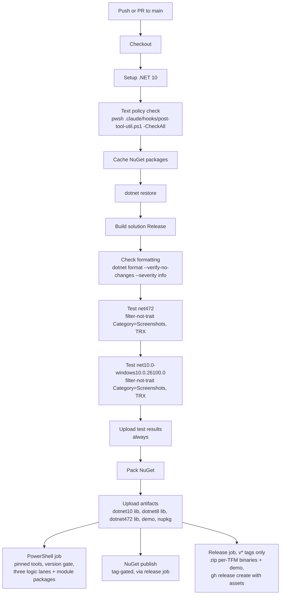

# Fluence.Wpf - Developer Handbook

Self-contained persistent memory for engineers (human and AI) working in this repository. Read top-to-bottom before touching code. This file is the single source of truth for conventions, architecture, reference authority, testing policy, and workflow; do **not** rely on out-of-repo agent bundles, external skill packs, or downstream-consumer-specific paths.

> **Portability rule** - everything in this handbook must remain usable by anyone consuming `Fluence.Wpf`, regardless of downstream product. Consumer-specific guidance (e.g. for a particular deployment toolkit) belongs in that consumer's own repo, not here.

---

## 1. Project overview

- **Fluence.Wpf** is a WPF control library that recreates the **Windows 11 Fluent / WinUI 3** visual language and interaction patterns on WPF.
- **Target frameworks** - library: `net472` (primary), `net8.0-windows10.0.26100.0` (PowerShell 7 in-process consumption), and `net10.0-windows10.0.26100.0`. Tests: `net472` and `net10.0-windows10.0.26100.0`. Gallery demo (`Fluence.Wpf.Demo`) targets `net472` and `net10.0-windows10.0.26100.0`; MVVM demo (`Fluence.Wpf.Demo.Mvvm`) targets `net10.0-windows10.0.26100.0`.
- **Language**: `LangVersion=latest` across all TFMs, set centrally in `Directory.Build.props` - no per-TFM language restriction. `net472` still constrains **runtime API** availability (see [Section 4.3](#43-feasibility-test-for-net472)); avoid APIs that don't ship in `net472`, but C# language features themselves are not restricted. Nullable reference types are **enabled** (`Nullable=enable` in `Directory.Build.props`); individual projects may override with `<Nullable>disable</Nullable>` (e.g. `Fluence.Wpf.Demo.Mvvm`).
- **License**: BSD 3-Clause. Every `.cs` file begins with the same 27-line header; copy it verbatim from any existing library file when adding new sources. Do not edit the copyright year unless the user asks.
- **OS**: Windows 10 1809+ baseline. Mica and rounded-corner extras light up on Windows 11.
- **XML namespace URI**: `http://schemas.fluencewpf.com` - suggested prefix `fluence`. 

### Solution layout

```text
Fluence.Wpf.sln
├── Fluence.Wpf/             Control library (multi-TFM: net472 + net8.0-windows10.0.26100.0 + net10.0-windows10.0.26100.0)
├── Fluence.Wpf.Demo/        Gallery app (net472 + net10.0-windows10.0.26100.0) - visual verification for all controls
├── Fluence.Wpf.Demo.Mvvm/   MVVM Task Manager demo (net10.0-windows10.0.26100.0) - CommunityToolkit.Mvvm example
├── Fluence.Wpf.Tests/       xunit.v3 suite (net472 + net10.0-windows10.0.26100.0)
├── Fluence.Wpf.Tests.Smoke/ xunit.v3 smoke lane (net8.0-windows10.0.26100.0)
└── Fluence.Wpf.PowerShell.Module/   Script module (not in the solution): src/, tests/, examples/, build/
```

#### PowerShell module

`Fluence.Wpf.PowerShell.Module/` holds the `Fluence.Wpf.PowerShell` script module: declarative Fluent dialogs, prompts, progress and windows for Windows PowerShell 5.1 and PowerShell 7, built on the library. It is deliberately not a project in `Fluence.Wpf.sln`; `build/Build-Module.ps1` stages the library's Release `net472` and `net8.0-windows10.0.26100.0` outputs into `src/Fluence.Wpf.PowerShell/lib/` (gitignored), and `build/Package-Module.ps1` produces the zip and nupkg under `artifacts/`. The PowerShell code follows the PSADT conventions rather than the C# ones in this handbook: 5.1 and 7 compatible syntax only, one function per file with comment-based help and `[OutputType()]`, fully qualified .NET type names, Allman braces, UTF-8 BOM, and `PSScriptAnalyzerSettings.psd1` at the module root as the analyzer gate. It resolves the library's renamed enums at call time (`Resolve-FluenceLibraryType`), so it runs against the `BackdropType` and `WindowBackdropType` generations of the library alike. User documentation lives in [docs/powershell/](docs/powershell/README.md).

### CLR namespaces

| Namespace                | Contents                                                                                                                                                                                                  |
| ------------------------ | --------------------------------------------------------------------------------------------------------------------------------------------------------------------------------------------------------- |
| `Fluence.Wpf`            | `ApplicationThemeManager`, `ApplicationAccentColorManager`, `SystemThemeWatcher`, `ThemeChangedEventArgs`, theme enums, control enums, and event args such as `TabViewTabCloseRequestedEventArgs`         |
| `Fluence.Wpf.Controls`   | Custom controls (`Button`, `TabView`, `Card`, `NavigationView`, etc.), `FluenceWindow`, `TitleBar`, layout controls, and the navigation view family. `WindowPolicy` and `CaptionButtonChrome` live here but are `internal`. |
| `Fluence.Wpf.Automation` | UI Automation peers for controls such as `NavigationView`, `ToggleSwitch`, `DropDownButton`, `SplitButton`, `ToggleSplitButton`, `NumberBox`, `InfoBar`, and `ProgressRing`                                                     |
| `Fluence.Wpf.Markup`     | WinUI theme-XAML parity: `ThemeResourceExtension` (`{fluence:ThemeResource}`), `ThemeDictionary`, `ThemeResourceDictionary`, `ThemeResourceDictionaryCollection`                                          |
| `Fluence.Wpf.Helpers`    | Internal helpers, none of them public                                                                                                                                                                    |
| `Fluence.Wpf.Native`     | P/Invoke constants, structs, and methods                                                                                                                                                                  |

XAML themes are under `Fluence.Wpf/Themes/` and are **not** a CLR namespace.

---

## 2. Coding standards

### File header (required)

Every `.cs` file in the library, demo, and tests starts with the BSD 3-Clause header used by any existing source file (e.g. `Fluence.Wpf/ApplicationThemeManager.cs` lines 1-27). Never delete, shorten, or paraphrase it.

### Language features

- Avoid em dash or en dash characters anywhere in documentation or comments.
- All TFMs use `LangVersion=latest` (set in `Directory.Build.props`). Use modern C# features freely; verify any runtime API is available in `net472` before using it.
- Do not guard blocks with `#if NET10_0_OR_GREATER` to gain runtime APIs not present in `net472`; instead apply [Section 4.3](#43-feasibility-test-for-net472) guidance.
- Nullable reference types are **enabled** (`Nullable=enable` in `Directory.Build.props`). Library and test code must be nullable-clean - annotate parameters and returns with `?` only where genuinely nullable.
- `public` API must have `///` XML doc comments. The library builds with `<DocumentationFile>` and does not suppress `CS1591` / `CS1574`; missing comments fail the build.
- **File encoding**: `.editorconfig` sets `charset = utf-8-bom` for all files. At minimum, all `.cs`, `.xaml`, `.csproj`, `.props`, `.targets`, and `.md` files must be saved as **UTF-8 with BOM** (EF BB BF). Never commit UTF-16 LE files - they produce spurious full-file diffs, break `grep`-based tooling, and may cause XML parser failures on some build agents. If your editor does not default to UTF-8 with BOM, configure it project-wide. Verify with `[System.IO.File]::ReadAllBytes($path)[0..2]` - must be `0xEF 0xBB 0xBF`.

### Warnings and analyzers

`Directory.Build.props` + `.editorconfig` harden the compiler to the maximum:

- **`TreatWarningsAsErrors=True`** and **`WarningLevel=9999`**: every diagnostic is a build error. Fix root cause; never suppress without an explicit entry.
- **`AnalysisLevel=latest-all`** + **`EnforceCodeStyleInBuild=true`**: all Roslyn analyzers and IDE style rules run as build-time errors across every project.
- **`CheckForOverflowUnderflow=True`**: arithmetic that overflows fails the build. Win32 bit-mask operations (HIWORD/LOWORD extractions from `lParam`) **must** be wrapped in `unchecked { }`. See `FluenceWindow.HitTestTitleBar` for the canonical pattern.
- **`Microsoft.CodeAnalysis.BannedApiAnalyzers`** (RS0030) reads `BannedSymbols.txt` at the solution root. **`string.IsNullOrEmpty()` is banned** - always use `string.IsNullOrWhiteSpace()`. Adding new banned symbols requires updating `BannedSymbols.txt`.
- **`Microsoft.Extensions.StaticAnalysis`** (SonarAnalyzer): Sxxx rules run as errors; see `.editorconfig` for the suppressed subset.
- **`Meziantou.Analyzer`** runs with `MeziantouAnalysisMode=all-errors`; the small excluded set and the opt-in strictness options (`MA0002` collection expressions, `MA0053` sealed exceptions, `MA0075` / `MA0076` nullable types, `MA0153` data classification) live in `.editorconfig`.
- **`Roslynator.Analyzers`** runs with the `roslynator` category at error severity plus the explicit per-rule enables in `.editorconfig`.
- **`Meziantou.Polyfill`** closes specific `net472` (and `net8.0-windows`) API gaps at compile time through the opt-in `MeziantouPolyfill_IncludedPolyfills` allowlist: the shared core (`string.Contains(string, StringComparison)`, `System.Index`, `System.Range`, `System.Threading.Lock`, and the `NotNullWhen` / `DoesNotReturn` attribute closure the generated types need) lives in `Directory.Build.props`; each project appends its own extras by prefixing `$(MeziantouPolyfill_IncludedPolyfills)`. Entries are prefix-matched XML documentation IDs; prefer the narrowest ID that compiles (the broad `M:System.String.Contains|` prefix, for example, drags in a `char` overload whose polyfill needs `IndexOf(char, StringComparison)` and creates an MA0001-versus-MA0089 conflict at `IndexOf(char, int)` call sites). Polyfills are `PrivateAssets=all` source generation, never a runtime dependency. `EmitCompilerGeneratedFiles` mirrors the generated sources under `obj/**/generated`, but that folder is never pruned: after an allowlist entry is removed, its stale `.g.cs` files linger until a clean, so treat the folder as evidence of past builds, not of the current allowlist.

**Suppressions in `.editorconfig`** - do not re-enable without discussion:

- SonarAnalyzer: `S103`, `S104`, `S107`, `S109`, `S1067`, `S1121`, `S1659`, `S3358`, `S3869`
- Roslynator: `RCS1111`, `RCS1181`, `RCS1238`
- Meziantou: `MA0009`, `MA0051`, `MA0104`, `MA0107`, `MA0110`, `MA0177`, `MA0181`, `MA0214`
- Threading: `VSTHRD001`
- A `[*.xaml.cs]` block suppresses six more for generated-partial code-behind only: `CA1822`, `S1125`, `S1192`, `S2333`, `MA0038`, `MA0204`

The former `IDE0056` / `IDE0057` (index/range operators) and `CA1307` / `CA1310` / `CA1847` / `CA1866` (string comparison overloads) suppressions are gone. `System.Index` / `System.Range` and `string.Contains(string, StringComparison)` now compile on `net472` through the polyfill allowlist above, and the `StartsWith` / `EndsWith` / `IndexOf` string+`StringComparison` overloads are in-box on `net472`. The char overloads `CA1847` / `CA1866` suggest (`Contains(char)`, `StartsWith(char)`, `EndsWith(char)`) are still absent on `net472`, and array range slicing needs `RuntimeHelpers.GetSubArray`; a hit from those rules requires adding the matching allowlist entry before the suggested fix compiles.

**Per-library suppressions** (in `Fluence.Wpf.csproj` `<NoWarn>`):

- `SYSLIB1045` - regex source generator (not available on `net472`)
- `SYSLIB1054` - `LibraryImport` source generator (the seven `[DllImport]` declarations in `Native/NativeMethods.cs` cannot use it on `net472`)
- `S1244` - floating-point equality (necessary for pixel math)

Prefer `EventArgs.Empty`, `nameof(...)`, explicit `readonly`, and immutable helpers. **Never** use inline `#pragma warning disable` except in exceptional third-party interop cases.

### C# style conventions

`EnforceCodeStyleInBuild=true` + `AnalysisLevel=latest-all` make the following patterns **mandatory** (violations are build errors):

- **Explicit types over `var`**: `Color customColor = ...` not `var customColor = ...`. Exception: anonymous types have no explicit form.
- **Target-typed `new()`**: `MainWindow mainWindow = new()` not `var mainWindow = new MainWindow()` - use when the type is clear from the declaration.
- **Discard ignored returns with `_`**: methods that return a value must have the return consumed or explicitly discarded. `_ = Dispatcher.BeginInvoke(...)`, `_ = list.ApplyTemplate()`.
- **`default` not `default(T)`**: `Assert.AreNotEqual(default, value)` not `Assert.AreNotEqual(default(Color), value)`.
- **`is not` for null pattern checks**: `if (x is not FrameworkElement fe) throw ...` instead of `x as T; if (x is null) throw ...`.
- **`??` throw expressions**: `FindVisualChildByName<T>(...) ?? throw new InvalidOperationException(...)` instead of a separate null-check + throw block.
- **`const` for compile-time-known locals**: `const FrameworkPropertyMetadataOptions flags = ...` when a local's value is statically determined.
- **Auto-properties over manual backing fields**: `public static Color SystemAccentColor { get; private set; }` instead of a `private static Color _systemAccentColor` field plus an expression-bodied getter.
- **Remove redundant `using` directives**: unused imports are `error` (IDE0005).

### Naming

- Dependency properties: `public static readonly DependencyProperty FooProperty = DependencyProperty.Register(...)` with a CLR wrapper `public T Foo { get; set; }` and, when relevant, `OnFooChanged` static callback.
- Readonly DPs end with `...PropertyKey` private field + public `...Property = ...PropertyKey.DependencyProperty`.
- Template parts: for new code, `const string PART_Whatever = "PART_Whatever"`, so the identifier and its value are the same text; annotate the class with `[TemplatePart(Name = PART_..., Type = typeof(T))]`. Do not assume every in-tree constant already follows that shape: a number of older `[TemplatePart]`-attributed constants pair a differently shaped identifier with a value that is not the same text, and the shapes vary. Examples include a `Part` prefix (`NavigationView` `PartPaneColumn = "PaneColumn"`; `ToggleSwitch` `PartSwitchKnob = "SwitchKnob"` and `PartSwitchThumb = "SwitchThumb"`), a `Part` suffix (`FlyoutPresenter` `PresenterSurfacePart = "PresenterSurface"`; `TeachingTip` `TipRootPart = "TipRoot"`), a `Name` suffix (`ProgressBar` `IndicatorHostName = "ProgressBarIndicatorHost"`), and even a `PART_` prefix whose value drops the prefix (`TreeViewItem` `PART_ItemsHost = "ItemsHost"`). `PasswordBoxExtensions` `PartMainBorder` and `PartPlaceholder` follow the `Part`-prefix shape too, but resolve through `Template.FindName` rather than `GetTemplateChild` and carry no `[TemplatePart]` attribute at all, since `PasswordBox` is sealed. Do not extend any of these older forms to a new template part; new code always uses the `PART_Whatever` form whose identifier and value match. A private constant naming a plain `x:Name` that is not a template part contract, for example `DatePicker` `SegmentsHostName` or `TreeViewItem` `SelectionCheckBoxPart`, keeps ordinary PascalCase and no attribute. Part constants are `private`, with one exception: the nine on `NavigationView` are `internal` because the NavigationView tests read them and `InternalsVisibleTo("Fluence.Wpf.Tests")` already exists. Do not add a second exception.
- `PasswordBoxExtensions` and `ScrollBarExtensions` carry no `[TemplatePart]` or `[TemplateVisualState]`. They are static classes attaching behavior to a sealed or native framework type, so there is no class for the attribute to sit on. That is deliberate; do not re-flag it.
- Visual states: `[TemplateVisualState(GroupName = "CommonStates", Name = "Normal|PointerOver|Pressed|Disabled")]`.

### XAML

- Keep templates in `Fluence.Wpf/Themes/Controls/<ControlName>.xaml`, one file per control, merged from `Themes/Generic.xaml`.
- Use `DynamicResource` for any brush, color, corner radius, or typography value that must react to theme, accent, or high contrast at runtime.
- Use `StaticResource` only for immutable assets (glyphs, fixed icon paths, constant geometries).
- Never inline hard-coded hex colors in production templates; always go through a canonical WinUI-style key.
- Animation timings: **~100-167 ms** typical transitions (WinUI `ControlFastAnimationDuration`, `ControlNormalAnimationDuration`). Easing curves consistent with existing templates (`{StaticResource ControlFastOutSlowInKeySpline}` where present). That range is for a control changing appearance in place. Motion that carries something across a distance takes WinUI's own longer timing instead, and the two in the library are the `NavigationView` selection indicator travelling between items (600 ms, `NavigationView.cpp`) and its pane opening and closing (350 ms open, 120 ms close, `SplitView_themeresources.xaml`). A code-built animation that needs one of WinUI's key splines rather than a WPF easing mode uses `KeySplineEase`.
- Focus visual: default WPF focus rectangles off; use FluentControl focus brush tokens instead, as in the existing Button / Card templates.

#### XAML formatting and text policy

XAML style is governed by `.editorconfig`: 4-space indentation, UTF-8 with BOM, LF line endings, a final newline, and trimmed trailing whitespace, applied to `.xaml` like every other source file. There is no separate XAML formatter tool.

- Encoding and text policy are enforced by `.claude/hooks/post-tool-util.ps1`: on every edit (PostToolUse hook) and repo-wide in CI via `pwsh .claude/hooks/post-tool-util.ps1 -CheckAll`.
- The check blocks missing UTF-8 BOM, CRLF/CR line endings, `string.IsNullOrEmpty`, `TextOptions.*`, hard-coded hex in `Themes/Controls/**`, em/en dashes in `.cs` / `.md`, and `git diff --check` whitespace errors.
- **Generated XAML is excluded** from the repo-wide check: `Fluence.Wpf/Properties/DesignTime.*.xaml` (emitted byte-for-byte by `DesignTimeResourceWriter`; the `DesignTimeResources_AreCurrent` drift guard covers it).

---

## 3. Theme architecture

### Pipeline

The theme system is a single linear pipeline implemented in `Fluence.Wpf/Theming/FluenceThemeEngine.cs`. `ApplicationThemeManager` and `ApplicationAccentColorManager` are thin public facades that delegate to it; all color and brush computation lives in the engine.

```
Apply(themeRequest):
  1. theme   = ThemeResolver.Resolve(request)         // Light / Dark / HC from request + OS registry
  2. palette = AccentResolver.Resolve(accentIntent, theme)  // OS palette first, generate fallback, default blue;
                                                      // a two-seed custom intent picks its seed by resolved theme
  3. colors  = ColorMap.Build(theme, palette)         // one Dictionary<string,Color>:
                  per-theme Color tokens from Theme.*.xaml (Color-only XAML tables)
                  + the few theme-independent tokens (the Windows close-button brand
                    colors) seeded in code by BaseColorTables; Shared.xaml no longer exists
                  + all accent-derived keys computed once here
                  + title-bar colors (TitleBarActiveColor, TitleBarInactiveColor, WindowBorderColor)
  4. gate    = PublishFingerprint.Capture(theme, colors)   // resolved theme + the whole color map
                  + the live SystemColors members SpecialBrushes reads outside the map
                  + the Settings "Transparency effects" flag (RegistryHelper.GetEnableTransparency).
                  Equal to the last PUBLISHED fingerprint (and slot [0] still holds that
                  dictionary)? return; steps 5 to 7 are skipped, no events are raised
  5. dict    = BrushFactory.Build(colors)             // one ResourceDictionary: every Color token
                  + a frozen SolidColorBrush twin (key + "Brush") for each; SpecialBrushes.Add adds
                  gradient elevation borders, HC SystemColors overrides, and brush-only exceptions
  6. publish -> replace MergedDictionaries[0] with dict; DynamicResource consumers re-resolve
  7. raise FluenceThemeEngine.Published -> ApplicationAccentColorManager fires AccentColorChanged
                  (ApplicationThemeManager fires its own Changed from Apply, see below)
```

There is no key promotion, no swap-vs-mutate split, and no per-key copy-up into top-level `Application.Resources`. Every color and brush is built fresh and published as one dictionary replacement.

**Redundant-publish gate.** Windows emits several theme-relevant broadcasts for a single user action, and the 100 ms debounce in `SystemThemeWatcher` does not collapse all of them. Step 4 exists so a broadcast that changes nothing does not rebuild every brush and force a `DynamicResource` re-resolution storm. The fingerprint is exhaustive by construction: the color map already subsumes the accent ramp, the per-theme base tables, the registry-driven chrome, and the deterministic-chrome test switch. One input is carried separately because no color reflects it: the Settings "Transparency effects" flag. Toggling it broadcasts `ImmersiveColorSet` and changes what a window's backdrop should be, but not a single computed color, so without that field in the fingerprint the gate would swallow the broadcast, `Changed` would never fire, and the Windows 10 legacy-acrylic path in `FluenceWindow.ApplyBackdrop` would never re-read the setting. A publish that fails because `Application.Current` is null stores no fingerprint, so the next apply retries. `FluenceThemeEngine.ResetForTesting` clears it. Adding a new input to the published output means adding it to `PublishFingerprint`, or the gate will skip a change that should have shipped.

**Accent intent** is sticky and resolved on every Apply call. `AccentIntent.System` (the default) reads the full OS palette from the registry first; if that fails it falls back to the DWM colorization color and then to default blue. `Apply(theme)` alone uses the OS palette - there is no "must also call `ApplySystemAccent`" footgun. `ApplyCustomAccent(Color)` pins the ramp to the given color using the HSV generator; `ApplyCustomAccent(Color light, Color dark)` carries per-theme seeds resolved inside the engine on every apply (high contrast follows the dark seed); `ApplySystemAccent()` resets the intent to System.

**High contrast** is just another color table. Its tokens are resolved from live `SystemColors` in `SpecialBrushes.AddHighContrastBrushes`; there is no `_promotedHighContrastBrushKeys` list. A `WM_SETTINGCHANGE` via `SystemThemeWatcher` triggers a re-Apply, which rebuilds and republishes the HC brushes from the current `SystemColors` snapshot. Those `SystemColors` members are part of the publish fingerprint, so an HC variant switch always gets through the gate while a duplicate broadcast for the same variant does not.

### Merge slots

After `ApplicationThemeManager.Apply(...)` has run, `Application.Current.Resources.MergedDictionaries` always contains exactly **three** dictionaries in this fixed order:

|  Slot | Dictionary                    | Lifecycle                                              |
| ----: | ----------------------------- | ------------------------------------------------------ |
| `[0]` | Computed colors + brushes     | **Replaced** on every theme or accent change           |
| `[1]` | `Themes/Typography/Typography.xaml` | Loaded once; never replaced                      |
| `[2]` | `Themes/Generic.xaml`         | Loaded once; never replaced                            |

Slot `[0]` is the `ResourceDictionary` built by `FluenceThemeEngine.BuildComputedDictionary` each Apply. It carries a marker key so that seeding the slots again can remove it: Typography and Generic are matched by pack URI, but a computed dictionary is built in code and has no `Source`. Leaving one behind is not cosmetic, because WPF resolves merged dictionaries last-wins and a stale computed dictionary past slot `[0]` shadows every token the fresh one publishes. It holds every canonical Color token and its frozen `SolidColorBrush` twin, plus special brushes (elevation gradients, HC overrides, brush-only exceptions). Replacing it causes all `DynamicResource` bindings in control templates to re-resolve without any promotion step.

The slot layout is enforced by `DictionaryStabilityTests` - any change to count or ordering must be accompanied by a conscious update to both sides. The per-theme XAML files (`Themes/Colors/Theme.*.xaml`) are Color-only tables read by `BaseColorTables` at pipeline step 3; `Brushes.xaml` and `Accent.xaml` no longer exist.

### Canonical color/brush keys

Names align with WinUI 3. [docs/theming.md](docs/theming.md) is the canonical list of the published families, of which keys are supported, and of the two naming alias pairs kept for downstream consumers: `FluentFontFamily` and `ContentControlThemeFontFamily`, and `ApplicationBackgroundBrush` and `ApplicationPageBackgroundThemeBrush`. Those two pairs exclude the eight high contrast brushes the same document separately calls aliases: those map a Fluence key straight to a WPF `SystemColors` value rather than aliasing another Fluence key, a different sense of the word. docs/theming.md is the file to update when a family changes. The pipeline narrative above stays here.

### Theme API surface

- `ApplicationThemeManager.Apply(ApplicationTheme theme, WindowBackdropType backdrop = WindowBackdropType.Auto)` - first call seeds all three slots; later calls replace `[0]` with a freshly built computed dictionary.
- `ApplicationThemeManager.CurrentTheme` / `CurrentBackdrop` - read-only state.
- `ApplicationThemeManager.Changed` - `EventHandler<ThemeChangedEventArgs>`, raised once per applied change. `CurrentTheme` and `CurrentBackdrop` record the caller's *request* and are assigned on every `Apply`, even when the redundant-publish gate skips the rebuild. `Changed` fires when either the computed dictionary was republished or the requested theme or backdrop actually moved, so a backdrop-only change is observable without a dictionary rebuild, and a duplicate OS broadcast raises nothing.
- `ApplicationAccentColorManager.ApplySystemAccent()` / `ApplyCustomAccent(Color)` / `ApplyCustomAccent(Color light, Color dark)` - set the accent intent and re-run the full pipeline. Subscribe to `AccentColorChanged` for post-apply hooks. These bypass `ApplicationThemeManager.Apply`, so they raise only `AccentColorChanged`, and the redundant-publish gate applies: an apply whose resolved ramp matches the one already published raises nothing. Pinning the seed that is already pinned is a no-op. Tests that must observe the event have to make the apply a genuine transition.
- `SystemThemeWatcher.Watch(Window)` / `UnWatch(Window)` - Win32 settings-change hooks with debounce; fires `Changed` (via `ApplicationThemeManager`) once per logical OS change. **Do not assume more than one `Changed` per user action in tests.**
- `FluenceWindow` is the canonical WPF window with DWM backdrop, rounded corners, caption extension, and an optional title-bar content slot.

---

## 4. Reference priority

When a question arises about _"how should this look, behave, or be implemented?"_ - resolve it in this order. Never fabricate Fluent semantics from imagination; always cite an authoritative source.

### 4.1 General priority (applies to every question)

1. **In-tree precedent.** If a pattern already exists in `Fluence.Wpf/Themes/**/*.xaml`, `Fluence.Wpf/Controls/*.cs`, or `Fluence.Wpf.Tests/Infrastructure/ThemeTestHelpers.cs`, follow it. Consistency with the shipped surface trumps outside sources.
2. **Per-domain reference (see [Section 4.2](#42-per-domain-authority)).** Select the correct authority for the concern at hand.
3. **Published Windows 11 design guidance** on Microsoft Learn (Fluent Design docs, Windows App SDK docs). Use as a tie-breaker only, never as the primary spec.

Undocumented "looks right" choices are not acceptable in a PR. If nothing in the three layers above covers a specific case, raise it and get explicit guidance before implementing.

### 4.2 Per-domain authority

| Concern                                                                           | Primary authority                                                                                                                                               | Rationale                                                                            |
| --------------------------------------------------------------------------------- | -----------------------------------------------------------------------------------------------------------------------	| ------------------------------------------------------------------------------------ |
| Visual tokens (colors, brushes, typography, spacing, corner radii, timing curves) | [**WinUI 3 CommonStyles**](https://github.com/microsoft/microsoft-ui-xaml/tree/main/src/controls/dev/CommonStyles)	| Canonical Microsoft-owned Fluent design tokens and control visuals.                  |
| WPF-native window chrome (`WindowChrome`, DWM extension, caption buttons)         | [**.NET 10 WPF Themes**](https://github.com/dotnet/wpf/tree/main/src/Microsoft.DotNet.Wpf/src/Themes)			| WPF-specific idioms that WinUI 3 does not express; known to work on `net472`.        |
| Navigation patterns (`NavigationView` layout, selection indicator, pane modes)    | WinUI 3 CommonStyles (visual) + .NET 10 WPF Themes (WPF translation)							| Visuals are Fluent-canonical; composition must respect WPF templating constraints.   |
| Accent ramp generation and HSV tint math                                          | .NET 10 WPF Themes												| Includes a proven WPF implementation of the Windows accent ramp.                     |
| System theme detection (Light/Dark/HighContrast)                                  | .NET 10 WPF Themes												| WPF-compatible registry reads and `WM_SETTINGCHANGE` handling suitable for `net472`. |
| Individual controls (Button, CheckBox, RadioButton, ComboBox, ToggleSwitch, etc.) | WinUI 3 CommonStyles												| Canonical Fluent templates and visual states.                                        |
| Acrylic / Mica backdrops, rounded corners                                         | .NET 10 WPF Themes + [DWM API docs on Microsoft Learn](https://learn.microsoft.com/windows/win32/api/dwmapi/)		| DWM interop is the mechanism; .NET 10 WPF demonstrates the WPF hook.                 |
| Accessibility / automation peers                                                  | WinUI 3 CommonStyles + Windows UI Automation docs on Microsoft Learn							| Behavioural contract, not visual.                                                    |

### 4.3 Feasibility test for `net472`

When a reference pattern depends on an API that is not available on `net472` (CsWinRT, WinUI runtime types, `System.Text.Json` source generators, etc.):

1. **Prefer** the closest idiomatic WPF translation using `System.Windows.*` primitives - this is why .NET 10 WPF is listed as the primary authority for WPF-native concerns.
2. **Document** the gap in `KNOWN_ISSUES.md` with the specific API that is unavailable and what the chosen fallback gives up; create the file first if this is the branch's first accepted known issue.
3. **Never** add a new third-party runtime dependency to close a `net472` gap without explicit user approval.

---

## 5. Control authoring checklist

When adding a new control, always use skill `new-control`

When adding a new control or materially changing an existing one:

1. **CLR type**
   - Subclass the closest `System.Windows.Controls.*` (or `Control` / `ContentControl`).
   - In the static constructor: `DefaultStyleKeyProperty.OverrideMetadata(typeof(MyControl), new FrameworkPropertyMetadata(typeof(MyControl)));`.
   - Expose dependency properties; use `RegisterReadOnly` for state-only DPs (`IsPressed`, `IsValid`).
   - **Sealed framework type.** When the WPF control is `sealed` there is no derived type to write. `System.Windows.Controls.PasswordBox` is the one such control the library styles. Sealing blocks inheritance but not templating, so style the native type instead. Put an **implicit** style in `Themes/Controls/<Name>.xaml`, put the Fluence-only properties on a `<Name>Extensions` static class in `Fluence.Wpf/Controls/` as attached properties, and have the style attach a private per-instance behavior object that drives the template parts. The control then keeps its native focus, automation, and input handling. This is the only implicit style the library ships for a framework type; the other native-type styles (`ScrollBar`, `ScrollViewer`, `RepeatButton`, `Thumb`) stay keyed. Do not add a second one without agreeing it first. Attached-property accessors take the specific control type (`this System.Windows.Controls.PasswordBox obj`), not `DependencyObject`, so they cannot collide with the accessors on another `*Extensions` class. `RCS1224` requires the extension-method form on a class named `*Extensions`, and `TextBlockExtensions` already owns `GetPlaceholderText(DependencyObject)`.
   - **Event shape.** Use `EventHandler<TArgs>` when WinUI's counterpart carries typed args, and bare `EventHandler` when WinUI passes `object`. Use a WPF `RoutedEvent` only when the event must tunnel or bubble through a template: the six that do are `BreadcrumbBarItem.Click`, `Card.Click`, `SplitButton.Click`, `TabView.AddTabButtonClick`, `TabView.TabCloseRequested` and `TabViewItem.CloseRequested`, and there are to be no more. A routed event whose args class carries data declares `EventHandler<TArgs>` as its handler type rather than `RoutedEventHandler`, and the args class overrides `InvokeEventHandler` so dispatch stays a direct call. `TabViewTabCloseRequestedEventArgs` is the worked example. Each new args class lives in its own file directly under `Fluence.Wpf/`.
2. **Template**
   - Add `Themes/Controls/MyControl.xaml` as a standalone `ResourceDictionary` and merge it from `Themes/Generic.xaml`.
   - Mark template parts with `[TemplatePart]` attributes and wire them in `OnApplyTemplate`.
   - Wire up `VisualStateManager` groups (`CommonStates`, `FocusStates`, `CheckStates`, etc.) with Fluent timings (~100-167 ms).
3. **Resources**
   - Reuse canonical WinUI keys. If a concept is new (e.g. a brand-specific state), add a **color** to each `Themes/Colors/Theme.*.xaml` (Color-only XAML tables), then add the brush to `SpecialBrushes.cs` if it requires a non-standard twin name or a gradient, or rely on the auto-twin that `BrushFactory` emits for every Color key. `Brushes.xaml` no longer exists.
   - Add a design-time preview entry in `Fluence.Wpf/Properties/DesignTimeResources.xaml` assuming Light + `#0078D4`; add the demo counterpart only when the demo also needs designer-time resource resolution.
4. **Demo**
   - Add or extend a gallery page under `Fluence.Wpf.Demo/Pages/Gallery*.xaml`. Register the page in `MainWindow.NavigateTo(string tag)` if it should be navigable from the `NavigationView`.
5. **Tests (mandatory)**
   - Add `Fluence.Wpf.Tests/Control/MyControlTests.cs` holding one sealed class. Use `WpfTestSta.RunOnStaAsync`, `TestApp.EnsureLibraryTheme` from `IAsyncLifetime`, and the `VisualTree` and `BrushAssert` helpers.
   - Cover at minimum: default style applies, key template parts found, critical DP/state transitions, and (if theme-sensitive) one theme cycle via `ThemeTestHelpers.ApplyStandardThemeCycle`.
6. **Docs**
   - Append to `docs/controls.md` when the public catalogue changes.
   - Note new brush families in `docs/theming.md`.
   - Add a one-line entry under the current CHANGELOG section.

---

## 6. Testing

- **Framework**: xunit.v3 4.0.0 (`xunit.v3` / `xunit.runner.visualstudio`) via `Microsoft.NET.Test.Sdk` 18.9.0, running under Microsoft Testing Platform.
- **TFMs**: `net472` **and** `net10.0-windows10.0.26100.0`; both must pass. The library's third target framework, `net8.0-windows10.0.26100.0`, is covered by `Fluence.Wpf.Tests.Smoke`, a separate project that references the library alone, because the demo projects it would otherwise drag in do not target it. That lane is deliberately shallow (theme pipeline, accent, a window of controls, a `FluenceWindow`): it exists so the third shipped binary is loaded rather than only built and packed, and behaviour coverage stays with the two full lanes, where the source is identical. It is not baselined, and adding a case to it needs no allowlist entry.
- **Invocation**: run the built executable, not `dotnet test`. The SDK 10 VSTest bridge is gone.

  ```powershell
  Fluence.Wpf.Tests\bin\Debug\<tfm>\Fluence.Wpf.Tests.exe --filter-class <FullName> --no-ansi --progress off
  ```

  `--filter-class` and `--filter-not-class` take several space-separated class names after one flag.
- **The two lanes.** A single-process run of the whole `net472` assembly aborts with exit `-1` at a non-deterministic point (see `KNOWN_ISSUES.md`). Both TFMs therefore run as two complementary lanes whose union is provably the whole assembly, so a newly added class lands in lane B automatically rather than going unrun. Lane A is the seven costliest classes: `Fluence.Wpf.Tests.Gallery.DemoShellTests`, `Fluence.Wpf.Tests.Gallery.DemoSampleContractTests`, `Fluence.Wpf.Tests.Control.NavigationViewTests`, `Fluence.Wpf.Tests.Control.ProgressBarTests`, `Fluence.Wpf.Tests.Control.ContentDialogTests`, `Fluence.Wpf.Tests.Control.ColorPickerTests`, `Fluence.Wpf.Tests.Control.TimePickerTests`. Lane B is `--filter-not-class` over the same seven. Both lanes carry `--filter-not-trait "Category=Screenshots"`. Sum the two case counts per TFM and compare against the expected total.
- **Parallelization**: `[assembly: Parallelization(Mode = ParallelMode.None)]` lives in `Fluence.Wpf.Tests/Properties/AssemblyInfo.cs`, `xunit.runner.json` disables assembly and collection parallelism, and the test project sets `<TestTfmsInParallel>false</TestTfmsInParallel>`. WPF's shared `ResourceDictionary` and storyboard sealing is not thread-safe across parallel fixtures or target-framework lanes.
- **STA**: `WpfTestSta` in `Fluence.Wpf.Tests/Infrastructure/` owns a single STA thread plus `Dispatcher`. All UI-touching work goes through `WpfTestSta.RunOnStaAsync(...)`.
- **Layout**: one sealed class per subject, in the folder that owns the concern. Every folder is also a namespace segment, because `IDE0130` is an error here. Folder names are chosen so that no segment shadows a name the tests use: `Control/` rather than `Controls/`, because a segment `Controls` would shadow `Fluence.Wpf.Controls` at the 1200-plus `Controls.X` shorthand sites; `Gallery/` rather than `Demo/`, because a segment `Demo` would shadow `Fluence.Wpf.Demo`; and `Windowing/` rather than `Window/`, because a segment `Window` would shadow `System.Windows.Window`. The one residual shadow is the type `System.Windows.Controls.Control`, which is written out in full at the handful of sites that use it bare.

  | Folder | Contents |
  | ------ | -------- |
  | `Infrastructure/` | `WpfTestSta.cs`, `TestApp.cs`, `VisualTree.cs`, `BrushAssert.cs`, `LightThemeFixture.cs`, `ThemeTestHelpers.cs`, `DemoTestHost.cs`, `SlopwatchSuppressAttribute.cs`, and the remaining narrow support types (`ContentDialogTestHost.cs`, `DispatcherDelayWaits.cs`, `DispatcherWaits.cs`, `FluentButtonQueries.cs`, `InputSimulation.cs`, `LoopingSelectorTestSupport.cs`, `TemplatePartTransforms.cs`, `VisualGeometry.cs`) |
  | `Control/` | `<Control>Tests.cs`, one per control |
  | `Control/Rules/` | the nine rules asserted across many controls at once |
  | `Theming/` | theme engine, dictionary stability, accent, markup, metrics, parity, design-time |
  | `Windowing/` | `WindowPolicyTests`, `FluenceWindowTests`, `TitleBarTests`, `CaptionButtonTests`, `NativeMethodsTests`, `SnapLayoutHelperTests`, `WindowIconTests` |
  | `Gallery/`, `Gallery/Pages/` | the demo gallery shell, the sample contracts, and one class per gallery page |
  | `Tools/` | `GalleryScreenshotHarness.cs`, which is not a test |
  | `Baselines/` | the committed `--list-tests` baseline per TFM and the name-change allowlist |

- **Application and theme setup**: `TestApp.EnsureLibraryTheme()` resets the application, closes every open window, resets both managers, clears the resources, and applies a theme. It does **not** merge the demo dictionary. `TestApp.EnsureDemoTheme()` is the explicit opt-in that adds `DemoSharedStyles.xaml`, and only `Gallery/` uses it; a test elsewhere that needs it says so in a comment at its own call site, naming the demo style it depends on.
- **Per-test isolation**: required for every new class, and for everything under `Control/`, `Control/Rules/` and `Gallery/Pages/`. Such a class implements `IAsyncLifetime` and calls `TestApp.EnsureLibraryTheme()` (or `EnsureDemoTheme()`) from `InitializeAsync` on the STA thread; test bodies do not call a setup helper themselves. A class in which no test applies a theme, changes the accent, or toggles reduced motion takes `IClassFixture<LightThemeFixture>` instead and pays that cost once; calling `TestApp.EnsureLibraryTheme(theme, backdrop)` with a theme or backdrop argument, or calling `TestApp.EnsureDemoTheme()` at all, counts as applying a theme and disqualifies the class just as surely. Pure-logic classes (`WindowPolicyTests`, `NativeMethodsTests`, `SnapLayoutHelperTests`) take neither. The remaining exceptions predate this rule and still reset in the test body: `Windowing/FluenceWindowTests.cs`, `Windowing/TitleBarTests.cs`, seven `Theming/` classes (`DesignTimeResourceTests`, `TextRenderingPolicyTests`, `ThemeEngineUnitTests`, `ThemeMetricsTests`, `ThemeParityTests`, `ThemeTestHelpersTests`, `TypographyResourceContractTests`), and `Gallery/DemoResourceCleanupTests.cs`, `Gallery/DemoSampleContractTests.cs`, `Gallery/Pages/GalleryPageHeaderTests.cs`.
- **Shared helpers**: `WpfTestSta` (`RunOnStaAsync`, `DrainDispatcher`, `FindVisualDescendants`, `FindLogicalAndVisualDescendants`), `VisualTree` (`FindVisualChild`, `FindVisualChildByName`, `FindVisualChildByTypeName`, `FindVisualChildren`, `CloseWindowAndDrain`, brought in with `using static Fluence.Wpf.Tests.Infrastructure.VisualTree;`), `BrushAssert` (`AssertBrushColor`, `ResolvedColor`, `SolidColor`), `ThemeTestHelpers` (`ApplyStandardThemeCycle`, `AssertKeyThemeBrushesResolve`) and `DemoTestHost`. Do not reintroduce a private copy of any of them. Prefer the condition-based `WaitUntil(dispatcher, timeoutMs, predicate)` over a fixed delay.
- **Tests for controls** typically:
  1. Let the class `IAsyncLifetime` or `LightThemeFixture` do the reset; the body starts with the control.
  2. Create a minimal `Window`, attach the control, call `Window.Show()` so `ApplyTemplate` runs.
  3. Drive the control (simulate mouse or keyboard by invoking protected `OnMouse*` members via a small probe subclass if needed; see `ClickableCardProbe` in `Control/Rules/FluentStrokeTests.cs`).
  4. Assert via `VisualTree` helpers and `TryFindResource`.
  5. Drain with `WpfTestSta.DrainDispatcher` and close through `CloseWindowAndDrain(window)` in a `finally`.
- **InternalsVisibleTo**: the test assembly sees library internals; theme tests can call `ApplicationThemeManager.ResetForTesting()` to isolate fixtures.
- **Known failures**: `KNOWN_ISSUES.md` records the `net472` whole-assembly abort, the `net472` TimePicker flyout flake, and PowerShell dispatcher lifetime boundaries. A green local run requires passing assertions and a successful process exit. Do not merge if your own changes add to the known-failure count.
- **Baseline policy**: the HEAD-of-branch case count is the floor. `Fluence.Wpf.Tests/Baselines/` holds the `--list-tests` capture per TFM; a change that adds or removes a test case must update it and say why in `CHANGELOG.md`. Diff by method name, not by fully qualified name: classes get renamed, method names do not.
- **PowerShell module lanes**: `Fluence.Wpf.PowerShell.Module/tests/` is a Pester v5 suite (the gate pins Pester 5.8.0 and PSScriptAnalyzer 1.25.0; Pester 6 is not supported), broadly one `*.Tests.ps1` per public function plus the private helpers that carry logic. Three public cmdlets have no file of their own: the four theme cmdlets share `Theming.Tests.ps1`, and `Close-FluenceWindow` and `Show-FluenceWindow` are covered by `Show-FluenceWindow.Mta.Tests.ps1` and `Show-FluenceWindow.Render.Tests.ps1`. `build/Test-Module.ps1` is the gate: it runs PSScriptAnalyzer with the shipped settings plus a second pass for `PSPlaceOpenBrace` (a formatting rule the default set leaves out, and the one that enforces Allman braces), then Pester. Any Error or Warning fails, and so does a Pester discovery failure, which produces no failed case and would otherwise pass unnoticed. Two lanes: the **logic lane** (default) excludes the `UI` tag and is what CI runs under `pwsh`, `pwsh -MTA` and `powershell.exe -STA`; the **render lane** (`-IncludeUi`, which sets `FLUENCE_PS_UI=1`) opens and self-closes real windows and runs locally only, once per change, on `pwsh`, `powershell.exe -STA` and `pwsh -MTA` (the module-owned UI runspace path). Run the render lane as one batch and never interleave it with other work; the machine's foreground is in use. Case counts per lane are recorded in `docs/release.md` and move only with a CHANGELOG note. Test files import the module with `Import-Module ... -Force` in `BeforeAll`, so a private helper is reached through the module object (`& (Get-Module Fluence.Wpf.PowerShell) { ... }`), never by dot-sourcing a copy.
- **Screenshot harness**: `Fluence.Wpf.Tests/Tools/GalleryScreenshotHarness.cs` writes the ten documentation PNGs under `docs/screenshots/`. Capture is **opt-in**: the tests are `[Trait("Category", "Screenshots")]` and skip unless `FLUENCE_CAPTURE_SCREENSHOTS=1`, so an ordinary run never overwrites the committed images. DWM backdrops are not captured by `RenderTargetBitmap`, so each surface is hosted in a plain off-screen `Window` over a solid `SolidBackgroundFillColorBaseBrush`.

---

## 7. Build and run

```powershell
# from repo root
dotnet restore Fluence.Wpf.sln
dotnet build   Fluence.Wpf.sln -c Debug
Fluence.Wpf.Tests\bin\Debug\net10.0-windows10.0.26100.0\Fluence.Wpf.Tests.exe --filter-not-trait "Category=Screenshots" --no-ansi --progress off
Fluence.Wpf.Tests.Smoke\bin\Debug\net8.0-windows10.0.26100.0\Fluence.Wpf.Tests.Smoke.exe --no-ansi --progress off
```

The suite runs on Microsoft Testing Platform: run the built executable, not `dotnet test`. On `net472`, a single-process whole-assembly run aborts non-deterministically, so run that TFM as the two complementary lanes described in section 6 instead of one combined run.

- Zero errors, zero warnings - the library is `TreatWarningsAsErrors`.
- CI uses the same matrix in Release configuration, with separate `net472` and `net10.0-windows10.0.26100.0` test steps (each split into the two lanes) and TRX output. Keep local validation split by TFM unless there is a specific reason to run the combined multi-target command.
- The gallery demo is run with `dotnet run --project Fluence.Wpf.Demo/Fluence.Wpf.Demo.csproj -f net472` or the matching `net10.0-windows10.0.26100.0` TFM.
- For visual verification: exercise Light / Dark / High Contrast / Auto, a couple of accent swatches, Mica / Acrylic / Tabbed / None backdrops, and at least one control per gallery page.

[CONTRIBUTING.md](CONTRIBUTING.md) is the canonical source for the full build, test, format and text-policy command set. The commands above are the subset an agent needs most often.

### Package management and lock files

Package versions are managed centrally in [Directory.Packages.props](Directory.Packages.props). Do not put `Version` attributes on individual `PackageReference` items.

[nuget.config](nuget.config) closes the supply chain:

- Restore uses nuget.org and nothing else. Inherited user-level and machine-level feeds are cleared, so a package cannot arrive from a feed this repository does not name.
- Package source mapping binds every package ID to that feed, which is what blocks dependency-confusion substitution. Adding a private feed means giving it the narrowest patterns that cover its packages.
- `signatureValidationMode` is `require`, so any package without a valid nuget.org signature fails restore with `NU3034`. When nuget.org rotates its certificates this fails everywhere at once; regenerate the `trustedSigners` block with `dotnet nuget trust source nuget.org` rather than editing fingerprints by hand.

Every project has a committed `packages.lock.json` pinning the exact resolved version and content hash of each dependency, transitive ones included:

- **Changing a package version means regenerating lock files.** Run `dotnet restore Fluence.Wpf.sln`, adding `--force-evaluate` when only a transitive dependency moved, then commit the changed `packages.lock.json` files together with the version change.
- **NuGet writes lock files with CRLF on Windows, and the text policy gate requires LF.** Normalise regenerated lock files before committing, or `-CheckAll` fails with "must use LF line endings".
- CI sets `RestoreLockedMode` through the `GITHUB_ACTIONS` environment variable, so a lock file that disagrees with its project fails the build with `NU1004` rather than being silently rewritten.
- Locked mode only validates a lock file that already exists. A project with no lock file restores clean and simply generates one, so check `git status` after adding a project.
- Dependabot raises weekly `nuget` updates. If one of those pull requests bumps a version without regenerating the lock files, CI fails with `NU1004`; regenerate locally and push to that branch.

### CI/CD pipeline

CI is defined in [.github/workflows/build.yml](.github/workflows/build.yml) and triggered by any push or pull request targeting `main`, plus `v*` tag pushes. The `build` job on `windows-latest` checks text policy (UTF-8 BOM, LF, banned APIs), restores, builds Release, verifies formatting with `dotnet format --verify-no-changes --severity info`, runs both TFM test lanes (excluding the `Screenshots` category) with TRX output, then packs and uploads artifacts (net472, net8.0-windows, and net10.0-windows library binaries, the demo, and the nupkg). A separate `powershell` job consumes the uploaded net472 and net8 library artifacts, checks module/tree version agreement, runs the three PowerShell logic lanes, and packages the module. Its PSGallery tooling setup and test failures do not prevent .NET artifact production or block the library release job. Both jobs must pass before merging the PR. Pester 5.8.0 and PSScriptAnalyzer 1.25.0 are pinned for that job. Windows PowerShell setup installs NuGet provider 2.8.5.208 explicitly; PowerShell Core may use its built-in provider. Packaging never silently bootstraps a missing provider. A `v*` tag additionally runs a `release` job after `build` succeeds: it zips the per-TFM binaries and the demo, and creates the GitHub release for the tag with those assets and the nupkg attached (tags containing a hyphen, such as `-rc.1`, `-preview`, or `-beta`, are marked prerelease). NuGet publish is live: the same `release` job fails closed if the tag does not match the version in `Directory.Build.props` or if `CHANGELOG.md` has no matching version section, then pushes the nupkg, with its sibling snupkg, to nuget.org using the `NUGET_API_KEY` secret. Creating and pushing the `v*` tag itself remains the owner's manual step.


```mermaid
flowchart TD
    A[Push or PR to main] --> B[Checkout]
    B --> C[Setup .NET 10]
    C --> G[Text policy check<br/>pwsh .claude/hooks/post-tool-util.ps1 -CheckAll]
    G --> D[Cache NuGet packages]
    D --> E[dotnet restore]
    E --> H[Build solution Release]
    H --> F["Check formatting<br/>dotnet format --verify-no-changes --severity info"]
    F --> I[Test net472<br/>filter-not-trait Category=Screenshots, TRX]
    I --> J[Test net10.0-windows10.0.26100.0<br/>filter-not-trait Category=Screenshots, TRX]
    J --> K[Upload test results<br/>always]
    K --> L[Pack NuGet]
    L --> M[Upload artifacts<br/>dotnet10 lib, dotnet8 lib, dotnet472 lib, demo, nupkg]
    M --> P[PowerShell job<br/>pinned tools, version gate,<br/>three logic lanes + module packages]
    M --> N[NuGet publish<br/>tag-gated, via release job]
    M --> R[Release job, v* tags only<br/>zip per-TFM binaries + demo,<br/>gh release create with assets]
```

---

## 8. Demo applications

### Fluence.Wpf.Demo (gallery, net472 + net10.0-windows10.0.26100.0)

- `MainWindow` is a `FluenceWindow` with `ExtendsContentIntoTitleBar="True"` in source, `SystemBackdropType="Mica"`, and a custom `TitleBar` slot hosting the app icon, title, a `TextBox` **search** bound to filter menu items, and caption buttons.
- `NavigationView` named `DemoNav`: default `PaneDisplayMode="Left"` in source and opens expanded with `IsPaneOpen="True"` to showcase the full pane.
- Menu items carry `Tag` strings; `MainWindow.NavigateTo(string tag)` does a switch to the matching `Gallery*Page` inside the content frame. Navigation remains tag-driven, with a lightweight visited-page stack only for the shell Back button.
- `GalleryHomePage` shows a theme-aware hero lockup (the `FluenceHeaderLightDrawingImage` vector on light themes, `FluenceHeaderDarkDrawingImage` on dark themes, swapped declaratively by a `ThemeDictionary` in the page resources; the `HighContrastBlack` / `HighContrastWhite` polarity tables pick by system window luminance, no code-behind subscription) and large **clickable `Card`** tiles that route through the same `NavigateTo` helper. Window controls and app-level theme/navigation/backdrop options live on the Settings page.
- 17 navigation-catalog pages: Home, Colors, Icons, Typography, Buttons, Selection, Inputs, Forms, Data, Data binding, Trees, Menus, Navigation, Tabs, Layout, Status, and Accessibility. Settings is a `NavigationView.FooterMenuItems` entry (a real, selectable footer nav item with the shared selection indicator), not a `DemoNavigationCatalog` item; footer navigation is routed through `DemoNav.ItemInvoked`.
- Run: `dotnet run --project Fluence.Wpf.Demo/Fluence.Wpf.Demo.csproj -f net472` or `dotnet run --project Fluence.Wpf.Demo/Fluence.Wpf.Demo.csproj -f net10.0-windows10.0.26100.0`.

### Fluence.Wpf.Demo.Mvvm (MVVM Task Manager, net10.0-windows10.0.26100.0)

- Minimal Task Manager demonstrating `FluenceWindow` + Fluence controls with no interaction logic in code-behind. `MainWindow.xaml.cs` only sets `DataContext` and calls `InitializeComponent`; app startup remains in `App.xaml.cs`.
- Uses **CommunityToolkit.Mvvm** 8.4: `[ObservableProperty]`, `[RelayCommand(CanExecute=nameof(CanAdd))]`, `partial void OnXxxChanged` source-generated callbacks.
- `MainViewModel` owns an unfiltered `ObservableCollection<TaskItemViewModel>` and rebuilds `DisplayedTasks` on every filter or completion change. `StatusText` and `ProgressValue` are derived and notified after the rebuild - do **not** add `[NotifyPropertyChangedFor]` on `_activeFilter`; that would fire notifications before `DisplayedTasks` is rebuilt (stale read).
- Filter radio buttons use `EnumToBoolConverter` with `ConverterParameter={x:Static vm:FilterMode.*}`.
- Delete button inside `DataTemplate` reaches `MainViewModel.DeleteCommand` via `RelativeSource AncestorType=Window`; this is deliberate - keeps `TaskItemViewModel` free of parent references.
- `App.xaml` contains **no `MergedDictionaries`**; `ApplicationThemeManager.Apply` (called from `App.xaml.cs`) seeds all three slots ([0] computed, [1] Typography, [2] Generic). A manual `Generic.xaml` merge would become a fourth stale entry and corrupt slot indices.
- Run: `dotnet run --project Fluence.Wpf.Demo.Mvvm/Fluence.Wpf.Demo.Mvvm.csproj`.

---

## 9. Common pitfalls

- **`StaticResource` on a theme- or accent-bound brush** -> stale colors after the first theme switch. Fix: change to `DynamicResource`.
- **Clearing `Application.Current.Resources.MergedDictionaries`** directly, then adding your own, without going through `ApplicationThemeManager.Apply` -> broken `DynamicResource` chains and missing templates. Fix: always go through the manager; the first call initializes all slots.
- **Creating `FrameworkElement` instances on a worker thread** in tests -> `InvalidOperationException`. Fix: route through `WpfTestSta.RunOnStaAsync`.
- **Skipping `[assembly: Parallelization(Mode = ParallelMode.None)]`** (or dropping `xunit.runner.json`) on a new test project / renaming the assembly-info entry -> intermittent `ResourceReferenceExpression` / sealed-storyboard failures.
- **Assuming the old "subtle stroke" for selection rings** -> RadioButton / CheckBox rings disappear in light theme. Fix: use `ControlStrongStrokeColorDefaultBrush` (and `ControlStrongStrokeColorDisabledBrush` for disabled state).
- **Hard-coding caption metrics or backdrop flags in child controls** -> breaks on Windows 10 / unsupported DWM builds. Fix: read `OsVersionHelper` and honour `FluenceWindow` policy.
- **Replacing the demo's tag navigation with an external navigation service** -> divergence with the current `NavigateTo` contract. Keep routes tag-driven; the only stack is the lightweight shell Back history in `MainWindow`.
- **Holding designer-only brushes as immutable resources** -> designer no longer matches runtime after a theme change. Fix: keep `Properties/DesignTimeResources.xaml` minimal and aligned with Light + `#0078D4`.
- **Relying on a previous test's theme state leaking into yours** -> intermittent color-alpha mismatches when tests run as a suite but pass in isolation. Fix: the class, not the test body, owns the reset. Implement `IAsyncLifetime` and call `TestApp.EnsureLibraryTheme()` from `InitializeAsync` through `WpfTestSta.RunOnStaAsync`, or take `IClassFixture<LightThemeFixture>` if no test in the class applies a theme, changes the accent, or toggles reduced motion. Do not call a setup helper from inside a test body.
- **Binding to a prefixed attached-property path from a theme dictionary** -> the binding fails at runtime with `BindingExpression path error: '(controls:MyExtensions.MyProp)' property not found on 'object'`, and the target silently keeps its default. The path parser cannot resolve the xmlns prefix from BAML loaded out of `Themes/Generic.xaml`, so `{Binding (controls:PasswordBoxExtensions.CornerRadius), RelativeSource={RelativeSource TemplatedParent}}` and the `DataTrigger` equivalents never evaluate, while a code-built `new PropertyPath("(0)", MyExtensions.MyProperty)` binds correctly. Fix: drive those parts from the behavior in code (see `PasswordBoxExtensions.UpdateChromeCore`), or build the binding in code with the resolved `DependencyProperty`. `TemplateBinding` and plain property `Trigger`s are unaffected; only string paths naming an attached property by prefix are.
- **Using `string.IsNullOrEmpty()`** -> build error RS0030 (banned via `BannedApiAnalyzers` + `BannedSymbols.txt`). Fix: always use `string.IsNullOrWhiteSpace()`.
- **Win32 bit-mask arithmetic without `unchecked`** -> `OverflowException` at runtime; caught as a build error because `CheckForOverflowUnderflow=True`. Fix: wrap HIWORD/LOWORD extractions in `unchecked { }`. See `FluenceWindow.HitTestTitleBar` for the canonical pattern.
- **Ignoring a return value from a non-void method** -> build error CA1806. Fix: discard with `_ = method()`.
- **Immersive dark-mode DWM attribute differs by OS build** -> attribute 20 (`DWMWA_USE_IMMERSIVE_DARK_MODE`) only exists from Windows 10 build 18985 (20H1), so applying it on builds 17763 through 18984, which includes retail 1903 (18362) and 1909 (18363) as well as 1809, silently fails and the caption stays light; those builds require attribute 19. Fix: select via `NativeMethods.GetImmersiveDarkModeAttribute(OsVersionHelper.OsBuild)` (the 19-vs-20 threshold is build 18985 / Windows 10 20H1).
- **Auto-hide taskbar hidden under a maximized window** -> an auto-hide taskbar reports a work area equal to the full monitor, so a maximized custom-chromed window covers it and blocks the hover-reveal. Fix: in `WM_GETMINMAXINFO`, when `rcWork == rcMonitor`, shift the maximized rect 2 px on the auto-hide edge via `NativeMethods.GetAutoHideTaskbarEdge` + `ApplyAutoHideTaskbarShift`.
- **Subscribing static managers in a Window constructor leaks** -> `ApplicationThemeManager.Changed` and `ApplicationAccentColorManager.AccentColorChanged` are static, so subscribing in the constructor pins every constructed-but-never-shown `FluenceWindow` to their invocation lists forever. Fix: subscribe in `OnSourceInitialized` and unsubscribe in `OnClosed` so the lifetimes match.
- **Setting only `Window.Background` transparent for a DWM backdrop, leaving the HWND redirection surface black** -> a top-level WPF window has two background layers, and `HwndTarget.BackgroundColor` (the redirection surface WPF clears behind the content) defaults to opaque black. With an active backdrop the content `Background` is transparent, so the default-black redirection surface flashes before the system backdrop composites (the first-paint "black flash"), and it is worst under forced software rendering where the gap is widest. Fix: in `ApplyBackdrop`, set `HwndSource.CompositionTarget.BackgroundColor` to the same color as `Window.Background` (transparent for an active backdrop, the opaque theme fallback for `None`). This is why `FluenceWindow` needs no `DWMWA_CLOAK` first-paint guard - a cloak whose uncloak rides WPF-side signals (`ContentRendered` / `ContextIdle`) races the DWM composite and reintroduces the flash.

---

## 10. Documentation map

Public and repository documentation:

- [README.md](README.md)
- [CHANGELOG.md](CHANGELOG.md)
- [CONTRIBUTING.md](CONTRIBUTING.md)
- [SUPPORT.md](SUPPORT.md)
- [SECURITY.md](SECURITY.md)
- [docs/getting-started.md](docs/getting-started.md)
- [docs/theming.md](docs/theming.md)
- [docs/controls.md](docs/controls.md)
- [docs/winui-parity.md](docs/winui-parity.md)
- [docs/powershell/](docs/powershell/README.md) - the `Fluence.Wpf.PowerShell` module set; [docs/powershell.md](docs/powershell.md) is a stub pointing at it
- [docs/migration-guide.md](docs/migration-guide.md)
- [docs/roadmap.md](docs/roadmap.md)
- [docs/release.md](docs/release.md)
- [KNOWN_ISSUES.md](KNOWN_ISSUES.md)

Maintainer / AI context (this file and its siblings):

- [AGENTS.md](AGENTS.md) - this handbook
- [CLAUDE.md](CLAUDE.md) - pointer to this handbook for Claude-class assistants
- [.github/PULL_REQUEST_TEMPLATE.md](.github/PULL_REQUEST_TEMPLATE.md) - PR checklist shown to contributors
- [.github/workflows/build.yml](.github/workflows/build.yml) - Release build, split-TFM tests, package artifacts

---

## 11. Role definition and quality gates

When you are editing this repository, you are acting as a **senior C#/.NET WPF engineer and Windows-theme specialist**. Every change must honor the following gates:

1. **Standards respected**: BSD header, `LangVersion=latest` with nullable-clean code, XML docs on public API, `DynamicResource` for theme-bound values, no hard-coded RGB, canonical WinUI key names, no banned APIs (`string.IsNullOrEmpty` etc.).
2. **Reference authority followed**: any visual or behavioural decision is backed by [Section 4](#4-reference-priority) (in-tree precedent -> per-domain authority -> Windows 11 docs). Fabricated design choices do not pass review.
3. **Build clean**: `dotnet build Fluence.Wpf.sln -c Debug` with **zero** errors and **zero** warnings after your change on every TFM; Release must also remain clean for release and CI work.
4. **Tests green**: both TFM lanes pass; every new control, public API, or behaviour change ships with an xUnit test that exercises it, and the HEAD-of-branch pass count is the floor.
5. **Visual parity**: any template / XAML change is confirmed in `Fluence.Wpf.Demo` across Light, Dark, High Contrast, accent swap, and at least one backdrop. Capture screenshots (100% and 150% DPI) when visuals change materially.
6. **Docs synced**: public changes update `CHANGELOG.md`, and any of `README.md` / `docs/controls.md` / `docs/theming.md` that a consumer would rely on.
7. **Scope discipline**: do not touch unrelated files or rename things unless explicitly asked; do not commit without the user's explicit request.

### Consumer build compatibility

`Fluence.Wpf` has adopted the stricter consumer build requirements used by PSADT for release gating: warnings as errors, `latest-all` analyzers, code style enforcement, banned APIs, XML documentation generation, and the `net472` / `net8.0-windows10.0.26100.0` / `net10.0-windows10.0.26100.0` build matrix. Treat the stricter consumer policy as authoritative for release conformance. If this repo drifts from it, correct the drift unless an exception is explicit, documented in this handbook or the affected project file, and approved by the user.

Consumer build compatibility is a release gate. For build-policy, public API, project metadata, resource-copy, or packaging changes that can affect downstream consumption, verify the standalone Fluence build and the current release-gate consumer build. PSADT-specific paths or build artifacts may be cited only as release-gate evidence; do not make this handbook depend on consumer-local layout.

---

## 12. Exclusions (apply to _this_ handbook)

- No filesystem paths, build steps, or deployment artifacts specific to a downstream consumer product, except concise release-gate evidence when validating consumer build compatibility.
- No endorsement of, or dependency on, any particular third-party WPF library; keep comparisons, migration notes, and naming advice generic.
- No references to external agent bundles, skill packs, or remote tooling that are not already part of this repository.
- No speculative roadmap items; everything in this file must reflect code that exists on the current branch.

---

## 13. AI contributor workflow

LLM-assisted work in this repo is gated through the `.claude/` automation directory. Agents are explicit review/scaffold lanes you invoke; skills are scaffolding playbooks; hooks run automatically around tool calls and either inject `<system-reminder>` context or enforce file policy. This makes the conventions above discoverable and self-enforcing instead of relying on memory.

### 13.1 Agents (`.claude/agents/`)

Read-only or scaffolding subagents. Use the one whose lane matches your change:

| Agent | Use when |
| --- | --- |
| `theme-slot-auditor` | After any theme, brush, color, accent, or `ApplicationThemeManager` change - verifies the three-slot invariant, slot `[0]` rebuild, `DynamicResource` usage, `BrushFactory` auto-twinning, canonical key names, and the high-contrast rebuild. |
| `winui-parity-reviewer` | To compare WPF templates, resources, and behavior against WinUI 3 CommonStyles and official Microsoft guidance (visual fidelity). |
| `net472-feasibility-checker` | After adding APIs, language features, or dependencies - confirms the code still runs on the separate `net472` test lane (Section 4.3). |
| `documentation-updater` | After code changes that cause doc drift, or when writing/updating READMEs, getting-started guides, API references, CHANGELOGs, inline docs, or GitHub special files. |

### 13.2 Skills (`.claude/skills/`)

Step-by-step scaffolding playbooks that bake the checklists into the work:

| Skill | Use when |
| --- | --- |
| `new-control` | Scaffold a new custom control end to end against the Section 5 control authoring checklist (CLR type, template wired into `Generic.xaml`, design-time/demo entries, xUnit test class, docs/CHANGELOG). |
| `demo-sample-page` | Scaffold or extend a `Fluence.Wpf.Demo` gallery sample page. The full demo sample-page spec - page skeleton, color layering, the `DemoSampleControl` contract, catalog surfaces, and definition of done - lives in [.claude/skills/demo-sample-page/SPEC.md](.claude/skills/demo-sample-page/SPEC.md). Control samples in `Fluence.Wpf.Demo` render through `DemoSampleControl`; design reference pages that mirror WinUI Gallery catalog surfaces (such as Typography) may render directly. |

### 13.3 Hooks (`.claude/hooks/`)

Hooks run automatically on tool events; you do not invoke them:

| Hook | Behavior |
| --- | --- |
| `pre-tool-theme-slot.ps1` | PreToolUse advisory on theme-slot-critical edits (`ApplicationThemeManager.cs`, `Themes/Generic.xaml`). Injects a non-blocking `<system-reminder>` restating the three-slot invariant and the `BrushFactory` auto-twin rule. |
| `post-tool-util.ps1` | PostToolUse linter (and CI gate via `-CheckAll`) that blocks on text-policy violations: missing UTF-8 BOM, CRLF/CR line endings, `string.IsNullOrEmpty`, `TextOptions.*`, hard-coded hex in `Themes/Controls/**`, em/en dashes in `.cs` / `.md`, and `git diff --check` whitespace errors. |

### 13.4 Gating principle

- Theme, brush, or color changes -> review with `theme-slot-auditor`.
- Visual or control-template changes -> review with `winui-parity-reviewer`.
- `net472` runtime-API questions -> check with `net472-feasibility-checker`.
- New controls -> follow the `new-control` skill; new demo pages -> follow the `demo-sample-page` skill.
- XAML style is governed by `.editorconfig`; all touched text files are linted for encoding and text policy on write (`post-tool-util.ps1`) and repo-wide in CI (`-CheckAll`).
- Keep authoring and review in separate passes: the scaffolding skills create or revise content, and the read-only auditor/reviewer agents evaluate it as a later, independent pass.
