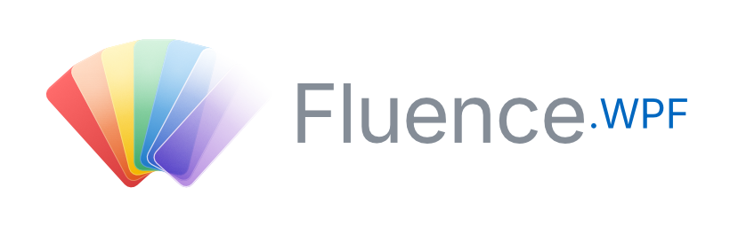



Windows 11 Fluent Design controls and theming for WPF applications targeting **.NET Framework 4.7.2** and **Windows 10** (1809+), with enhanced visuals on **Windows 11**.

**Current build:** `0.7.0-pre` (2026-06-03).

**Docs:** see the Markdown guides under [`docs/`](docs/) (start with [Getting started](docs/getting-started.md)).

## Features

- **Theming with auto Light / Dark mode** - Auto (follow Windows), Light, Dark, or High Contrast.
- **Accent colors** - System accent palette, app-defined accent, and custom accent ramps mapped to WinUI-style resource keys.
- **40+ Fluent-styled controls** - accessible and themed, aligned with their WinUI 3 counterparts.
- **PowerShell and .NET Framework 4.7.2 support** - build modern UIs for scripts and legacy apps without migrating to .NET 5+ or the Windows App SDK.
- **Small footprint** - 600 kb.

## Key controls
- **FluenceWindow** - A window with **Mica**, **Acrylic**, and **Tabbed (Mica Alt)** backdrops, rounded corners, configurable minimize / maximize / close buttons, and an extensible title bar for a WinUI-style search box or custom content.
- **Controls** - 40+ Fluent-styled controls: Button, HyperlinkButton, DropDownButton, SplitButton, RepeatButton, ToggleButton, CheckBox, RadioButton, ToggleSwitch, TextBox, PasswordBox, ComboBox, Slider, NumberBox, ProgressBar, ProgressRing, InfoBar, InfoBadge, RatingControl, PersonPicture, ListView, ListBox, Expander, Card (clickable), NavigationView, ContextMenu, MenuItem, Menu, ToolTip, TreeView, TreeViewItem, Separator, FontIcon, Border, StackPanel, DockPanel, SmoothScrollViewer, plus TabView and ScrollBar themes.
- **Typography** - Styles or Attached properties on `TextBlock` for the WinUI type ramp (Caption / Body / BodyStrong / Title / TitleLarge / Display).
- **TabView** - Multi-document surface over `TabControl` with per-tab close (`CloseRequested` / `TabCloseRequested`), trailing add-tab button (`AddTabButtonClick`), per-tab icons, `TabWidthMode`, `CloseButtonOverlayMode`, and horizontal overflow scroll.
- **NavigationView** - `Top`, `Left`, and `LeftCompact` pane modes with animated shared selection indicator, pane toggle + back button in the 48 px rail, and WinUI 3 content-region border (`CornerRadius="8,0,0,0"`, `CardStrokeColorDefault` top/left stroke).

## Demos
- **Gallery** - A code-behind WPF app for visual verification: theme swatches, accent picker, DWM backdrops, grouped control pages (Data Binding, Accessibility, Buttons, Selection, Inputs, Forms, Data, Trees, Navigation, Tabs, Menus, Status, Icons, Settings), inline examples, and embedded source for each one.
- **MVVM Pattern** - A minimal Task Manager (`Fluence.Wpf.Demo.Mvvm`) built with CommunityToolkit.Mvvm. It uses `[ObservableProperty]`, `[RelayCommand]`, filter bindings, and progress reporting with no code-behind.
- **PowerShell** - Build UIs for scripts from Windows PowerShell 5.1, without installing PowerShell 7, .NET 9 / 10, or the Windows App SDK.

## Quick Start

1. Add a project reference to `Fluence.Wpf` (or reference the built `Fluence.Wpf.dll` / local package).
2. In `App.xaml.cs` (before showing the main window):

```csharp
Fluence.Wpf.ApplicationThemeManager.Apply(
    Fluence.Wpf.ApplicationTheme.Auto,
    Fluence.Wpf.BackdropType.Mica,
    updateAccent: true);
Fluence.Wpf.ApplicationAccentColorManager.ApplySystemAccent();
```

3. Use `Fluence.Wpf.Controls.FluenceWindow`, or call `ApplicationThemeManager.Apply(...)` at startup and place Fluence controls in a standard `Window`.

Optional XML namespace mapping:

```xml
xmlns:fluence="http://schemas.fluencewpf.com"
```

## Control catalog

| Area                | Types                                                                                                                                       |
|---------------------|---------------------------------------------------------------------------------------------------------------------------------------------|
| Window              | `FluenceWindow`, `TitleBar`                                                                                                                  |
| Basic actions       | `Button`, `HyperlinkButton`, `DropDownButton`, `SplitButton`, `RepeatButton`, `ToggleButton`                                                |
| Selection           | `CheckBox`, `RadioButton`, `ToggleSwitch`, `ComboBox`, `Slider`, `NumberBox`                                                                |
| Text                | `TextBox`, `PasswordBox`, `TextBlockExtensions`                                                                                             |
| Data                | `ListView`, `ListBox`                                                                                                                       |
| Tabs                | `TabView`, `TabViewItem`                                                                                                                    |
| Feedback            | `ProgressBar`, `ProgressRing`, `InfoBar`, `InfoBadge`, `RatingControl`                                                                      |
| Navigation          | `NavigationView`, `NavigationViewItem`, `NavigationViewItemHeader`, `NavigationViewItemSeparator`                                           |
| Menus & popups      | `ContextMenu`, `MenuItem`, `Menu`, `ToolTip`                                                                                                |
| Trees & collections | `TreeView`, `TreeViewItem`                                                                                                                  |
| Layout / surfaces   | `Card`, `Expander`, `Border`, `StackPanel`, `DockPanel`, `SmoothScrollViewer`, `Separator`                                                  |
| Person / social     | `PersonPicture`                                                                                                                             |
| Icons               | `FontIcon`                                                                                                                                  |

## Installation

A NuGet package is coming. For now, use a project reference or build a local package:

```powershell
dotnet pack Fluence.Wpf/Fluence.Wpf.csproj -c Release -o ./artifacts
```
Or clone or submodule this repository and add a **project reference** to `Fluence.Wpf/Fluence.Wpf.csproj`.

## Requirements

- .NET Framework 4.7.2 and/or .NET 10 (Windows) - see the solution TFMs
- Windows 10 version 1809 or later
- Windows 11 recommended for full Mica / Acrylic / Tabbed backdrop support

## Building from Source

Prerequisites: [.NET SDK](https://dotnet.microsoft.com/download) (includes MSBuild), Windows.

```powershell
dotnet restore Fluence.Wpf.sln
dotnet build Fluence.Wpf.sln -c Release
dotnet test Fluence.Wpf.sln -c Release
```

## Running the Demos

- **Gallery demo** - all controls, themes, backdrops, accent picker, and NavigationView modes:

```powershell
dotnet run --project Fluence.Wpf.Demo/Fluence.Wpf.Demo.csproj -c Release
```

Use `-f net472` or `-f net10.0-windows10.0.26100.0` to force a specific gallery target framework.

**MVVM Task Manager demo** - minimal `FluenceWindow` + CommunityToolkit.Mvvm example with no code-behind:

```powershell
dotnet run --project Fluence.Wpf.Demo.Mvvm/Fluence.Wpf.Demo.Mvvm.csproj
```

Or set either project as the startup project in Visual Studio and press F5.

- **PowerShell demos** - four standalone scripts for PowerShell 5.1 that build WinUI-styled WPF UIs without writing C#:

See the [README.md](./Fluence.Wpf.Demo.PowerShell/README.md) for details.

## Documentation

The guides live under [`docs/`](docs/). A hosted documentation site is planned but not yet set up.

- [Getting started](docs/getting-started.md) - reference, startup calls, local pack
- [Theming](docs/theming.md) - merge order, accent, backdrop, watcher
- [Controls](docs/controls.md) - catalog aligned with the demo gallery
- [PowerShell](docs/powershell.md) - theme a WPF window from Windows PowerShell 5.1
- [Migration guide](docs/migration-guide.md) - generic move from other Fluent-style stacks
- [Contributing](docs/contributing.md) - build matrix, tests, PR notes
- [Release checklist](docs/release.md) - package, CI, screenshots, and tag flow

## Contributing

The contributor guide is at [docs/contributing.md](docs/contributing.md). It covers the build matrix, WPF test harness, visual verification expectations, changelog policy, and documentation rules.

For AI-assisted work, read [AGENTS.md](AGENTS.md) first.

## License

Licensed under the [BSD 3-Clause License](LICENSE).

Copyright © 2026 Dan Cunningham.
