# 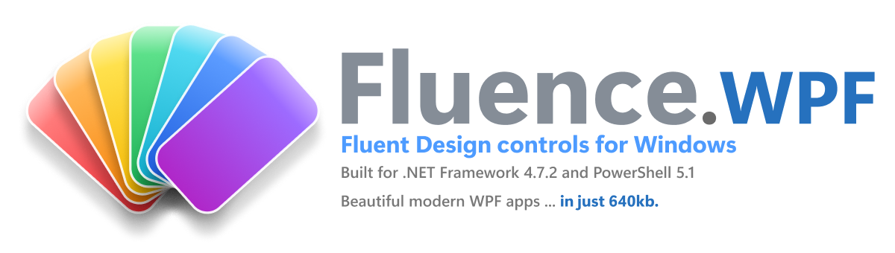

Windows 11 Fluent Design controls and theming for WPF, implemented in plain WPF with no Windows App SDK dependency.

[](https://www.nuget.org/packages/Fluence.Wpf)
[](https://www.nuget.org/packages/Fluence.Wpf)
[](https://github.com/sintaxasn/Fluence.Wpf/actions/workflows/build.yml)
[](LICENSE)
[](#requirements)

## Install

The package publishes to nuget.org from the `v0.9.0-pre` tag, so the two NuGet badges above stay
blank and the command below fails until that tag is pushed. Until then, reference
`Fluence.Wpf/Fluence.Wpf.csproj` directly, or build a local package with
`dotnet pack Fluence.Wpf/Fluence.Wpf.csproj -c Release`.

```powershell
dotnet add package Fluence.Wpf
```

```xml
<PackageReference Include="Fluence.Wpf" />
```

## Use it

```csharp
using Fluence.Wpf;

// App.xaml.cs, before the first window is shown.
ApplicationThemeManager.Apply(ApplicationTheme.Auto, WindowBackdropType.Mica);
```

```xml
<fluence:FluenceWindow
    x:Class="MyApp.MainWindow"
    xmlns="http://schemas.microsoft.com/winfx/2006/xaml/presentation"
    xmlns:x="http://schemas.microsoft.com/winfx/2006/xaml"
    xmlns:fluence="http://schemas.fluencewpf.com"
    ExtendsContentIntoTitleBar="True"
    SystemBackdropType="Mica"
    Title="My App">
    <fluence:FluenceWindow.TitleBar>
        <fluence:TitleBar Title="My App" />
    </fluence:FluenceWindow.TitleBar>
    <fluence:Button Content="Click me" Appearance="Accent" Margin="24" />
</fluence:FluenceWindow>
```

[Getting started](docs/getting-started.md) has the full setup, including theme switching and the system theme watcher.

## Screenshots

| Light Mode | Dark Mode       |
|:----------:|:---------------:|
| 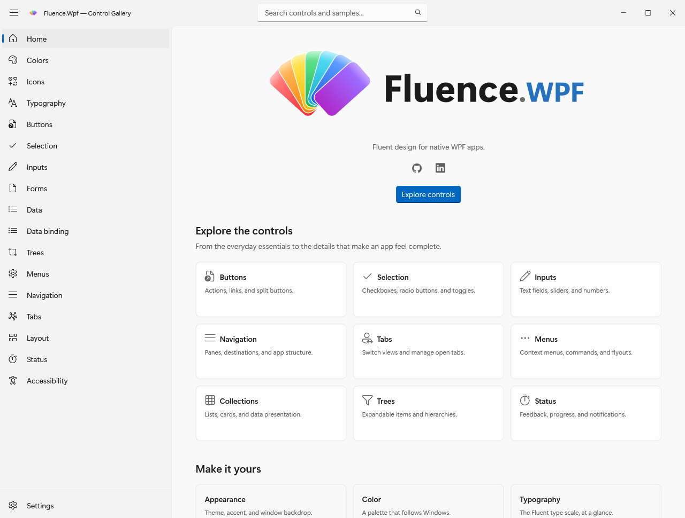 | 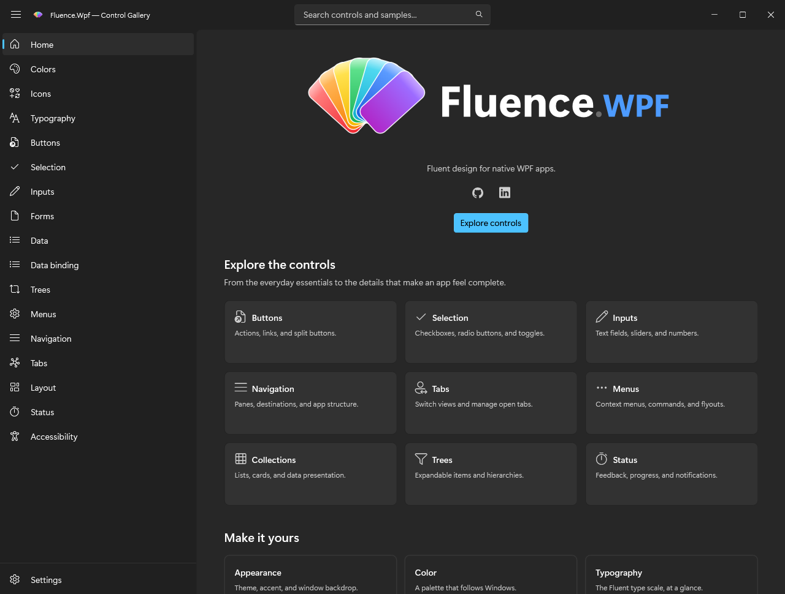 |
| 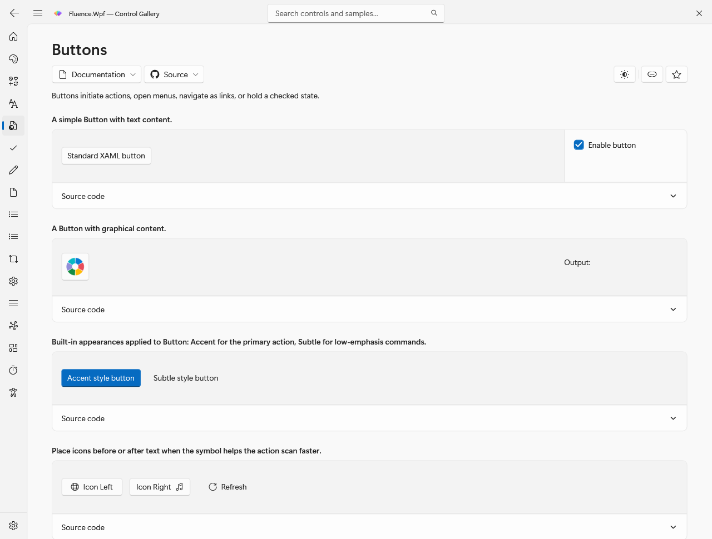 | 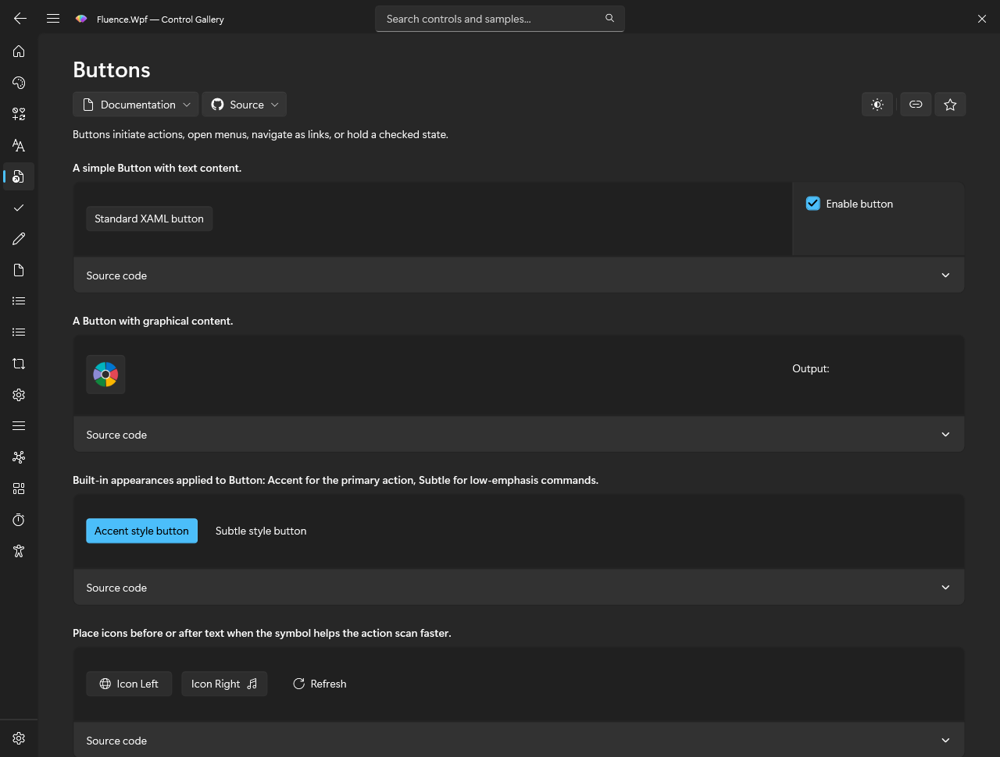 |
| 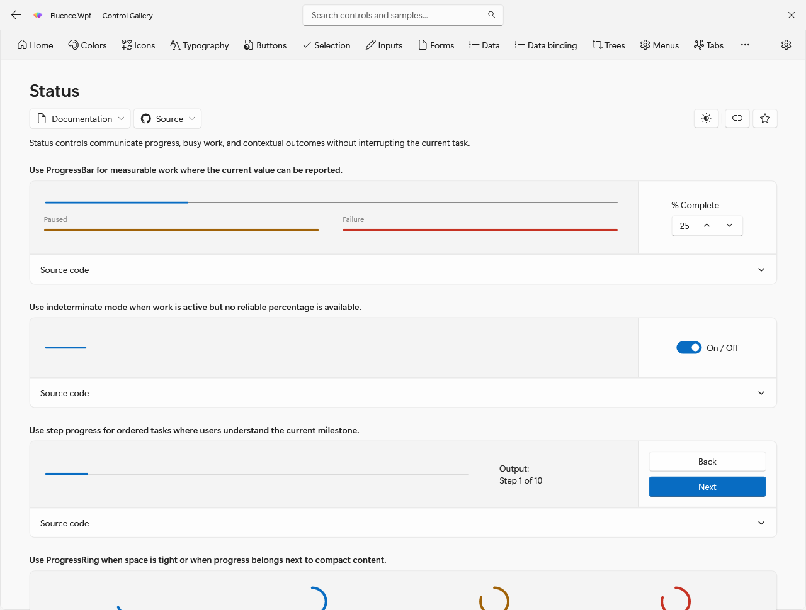 | 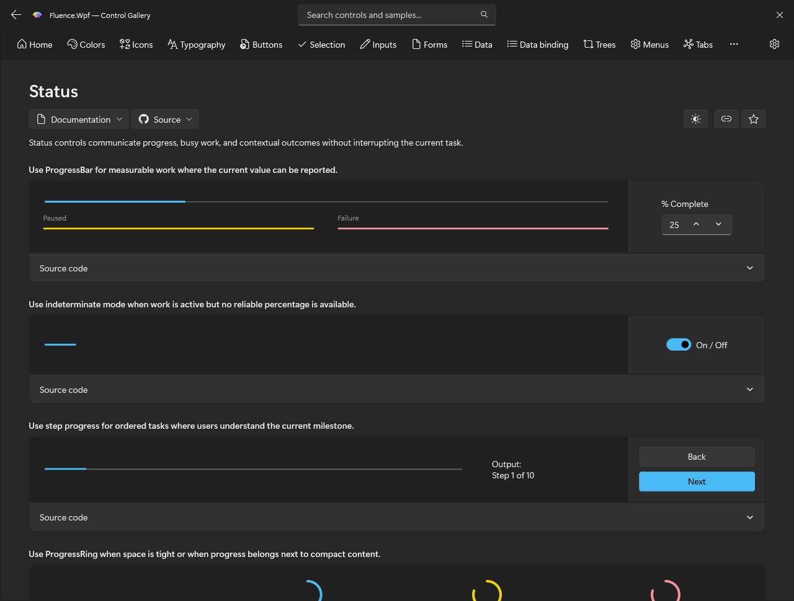 |
| 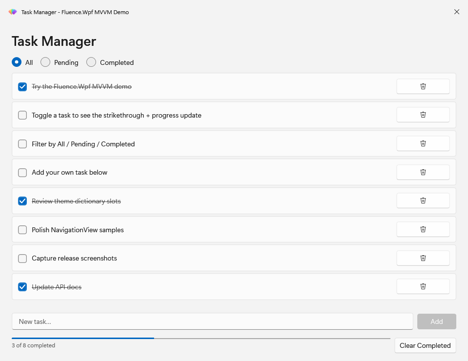 | 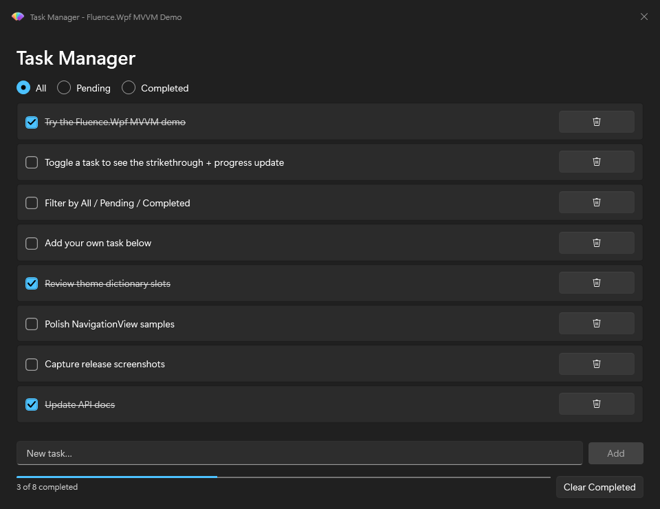 |
| 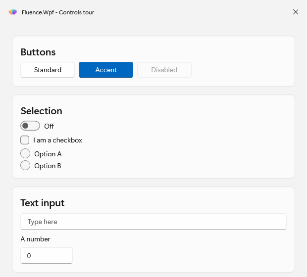 | 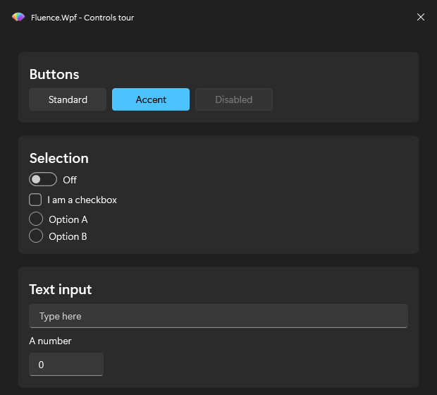 |

## What is in the box

**62 public `Fluence.Wpf.Controls` types that derive from `FrameworkElement`**, from `Button` and `TextBox` through `NavigationView`, `TabView`, `ContentDialog`, `ColorPicker` and `TreeView`, each aligned with its WinUI 3 counterpart and covered by tests. See the [control catalog](docs/controls.md) for the full list and the per-control notes.

**A theme engine** that resolves Light, Dark, High Contrast and Auto (follow Windows), generates the accent ramp from the OS palette or a colour you pin, and republishes every brush through `DynamicResource` so a running application re-themes with no restart and no per-control code. See [theming](docs/theming.md).

**`FluenceWindow`**, a window with Mica, Acrylic and Tabbed DWM backdrops, rounded corners, configurable caption buttons, and a title-bar content slot for a search box or your own content.

**Three target frameworks**, so the same UI runs on .NET Framework 4.7.2, .NET 8 and .NET 10, and from Windows PowerShell 5.1 and PowerShell 7 through the `Fluence.Wpf.PowerShell` module or a bare `Add-Type`, with no Windows App SDK anywhere. See [PowerShell](docs/powershell/README.md).

## Demos

- **Gallery** (`Fluence.Wpf.Demo`): 17 catalog pages organized by control category, each with a live example and its source next to it, plus theme, accent and backdrop switching.
- **MVVM Task Manager** (`Fluence.Wpf.Demo.Mvvm`): a minimal CommunityToolkit.Mvvm application with no interaction logic in code-behind.
- **PowerShell module** (`Fluence.Wpf.PowerShell.Module`): the `Fluence.Wpf.PowerShell` script module, with runnable examples under `examples/`, for Windows PowerShell 5.1 and PowerShell 7.
- **PowerShell, no module** (`Fluence.Wpf.Demo.PowerShell`): four standalone scripts that build a themed WPF UI from Windows PowerShell 5.1 with `Add-Type` alone.

```powershell
dotnet run --project Fluence.Wpf.Demo/Fluence.Wpf.Demo.csproj -c Release
```

## Requirements

- .NET Framework 4.7.2, .NET 8, or .NET 10 on Windows. The package ships `net472`, `net8.0-windows10.0.26100.0` and `net10.0-windows10.0.26100.0`.
- Windows 10 version 1809 or later.
- Windows 11 for Mica, Acrylic and Tabbed backdrops and for DWM rounded corners. On Windows 10 those degrade to a legacy acrylic or to an opaque surface, with no code change.

## Documentation

- [Getting started](docs/getting-started.md) - reference, startup calls, local pack
- [Theming](docs/theming.md) - merge order, accent, backdrop, watcher
- [Controls](docs/controls.md) - catalog aligned with the demo gallery
- [WinUI parity](docs/winui-parity.md) - where Fluence matches WinUI 3 and where it knowingly differs
- [PowerShell](docs/powershell/README.md) - the `Fluence.Wpf.PowerShell` module: tutorial, how-to guides, cmdlet reference
- [Migration guide](docs/migration-guide.md) - generic move from other Fluent-style stacks
- [Contributing](CONTRIBUTING.md) - build matrix, tests, PR notes
- [Release checklist](docs/release.md) - package, CI, screenshots, and tag flow
- [Roadmap](docs/roadmap.md) - release policy and what comes next
- [Changelog](CHANGELOG.md) - every released change
- [Known issues](KNOWN_ISSUES.md)

## Contributing

The contributor guide is at [CONTRIBUTING.md](CONTRIBUTING.md). It covers the build matrix, WPF test harness, visual verification expectations, changelog policy, and documentation rules.

For AI-assisted work, read [AGENTS.md](AGENTS.md) first.

## License

Licensed under the [BSD 3-Clause License](LICENSE).

Copyright 2026 Dan Cunningham.
