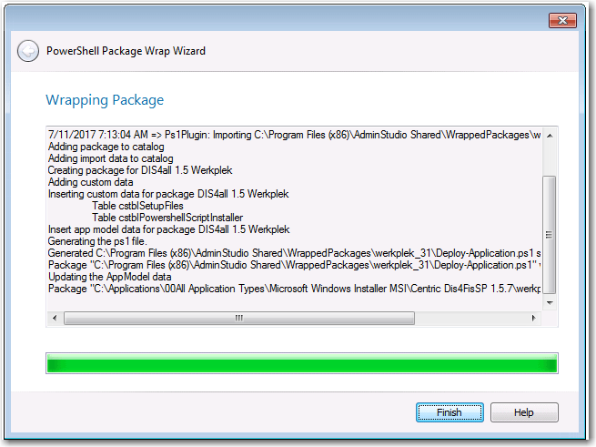

# 27th May 2018

## PSAppDeployToolkit now integrated in to Flexera AdminStudio

The PowerShell App Deployment Toolkit remains a free, open source, community developed tool. Due to popular demand, the PSADT is now integrated and distributed with Flexera Admin Studio. The following are some of the features that AdminStudio can perform with PSADT wrapped packages:

- Set PowerShell wrap options
- Generate the deploy-application.ps1 script for a package
- Import wrapped packages in to the application catalogue
- View child packages bundled within the script
- Test compatibility and best practices
- Generate reports on wrapped packages
- Distribute wrapped packages to SCCM
- Convert wrapped package to App-V format
- Automate generation of the deploy-application.ps1 script using a PowerShell cmdlet "Invoke-ASPowerShellWrap".

The PowerShell App Deployment Toolkit was initially developed in 2013 as a direct replacement for WiseScript. WiseScript was a 32-bit product and did not have support for 64-bit registry operations. Symantec deprecated WiseScript in 2011 and with the move to a Windows 7 64-bit OS, WiseScript was abandoned by many packagers. Wise Package Studio subsequently went EOL. The replacement for Wise Package Studio was Flexera's AdminStudio, however AdminStudio did not provide a replacement for WiseScript.

Fast forward to 2018 and Flexera have integrated and distributed the PSADT with Admin Studio, the industry-leading application packaging toolset. This is a testament to how far the PSADT has come on its journey and how broadly adopted it is in the industry, by small and large organisations. We're aware of many large organisations (50,000 – 300,000 seats) that wrap all of their applications with the PSADT for consistency.

We are enthused by the response from the community to this tool and that's why we plan to continue developing it – with your continued support. Our latest release was published in March 2018 and we plan to have another release later this year. 

**_The PowerShell App Deployment Team_**

## Press release for AdminStudio 2018: 

Here's an extract from a Flexera blog post on the PSADT:

**Why we love it**

This is a true timesaver, plain and simple, especially for those who don't have a lot of PowerShell experience. In addition, it provides greater control of your installation environment with functions you don't get with SCCM or other application distribution solutions function set!

Without PowerShell wrapping, your options for preparing an application for deployment are: repackage the vendor installer into a format for silent delivery mode, create a transform or run the installer silently.

By wrapping an existing Windows installer (.msi) or complex installation package (.exe) in a PowerShell script, you can automatically perform deployment tasks both before and after installation. The advantages of using PowerShell wrapping instead of repackaging or transforms to modify an installer include:

- The original package is not modified
- A consistent UI experience to your users for all of your organization's installers
- Provides a more powerful set of functionality than can be provided using transforms

Source: [Flexerra blog post](https://blogs.flexera.com/application-readiness/2017/08/faster-deployment-powershell-app-wrapping-quickly-prepares-software-for-deployment)