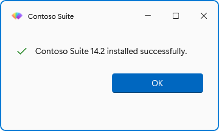
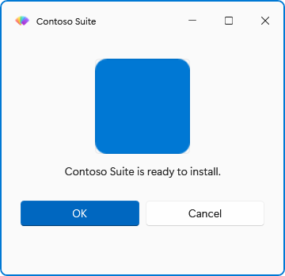
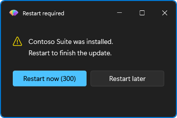

# How to show dialogs and messages

This guide covers the message and dialog cmdlets: choosing a button preset, building custom buttons, adding an icon or an image, closing a dialog on a timer, and placing it on the screen. It assumes you have imported the module (see the [tutorial](../tutorial.md) if not).

## Show a message and branch on the answer

Use `Show-FluenceMessage` with one of the four presets: `OK`, `OKCancel`, `YesNo`, `YesNoCancel`. It returns the name of the clicked button as a string.

```powershell
$answer = Show-FluenceMessage -Title 'Contoso Suite' -Message 'Remove the previous version first?' -Icon Question -Buttons YesNoCancel
switch ($answer)
{
    'Yes' { Remove-PreviousVersion }
    'No' { Install-SideBySide }
    default { return }
}
```

Closing the dialog with Esc or the title-bar X returns the preset's cancel button, or its last button when it has none: `OK` for `OK`, `No` for `YesNo`. You never get `$null` back, so a guard such as `if ($answer -eq 'Yes')` is safe on a dismiss.

`-Message` takes an array; each element becomes one paragraph:

```powershell
Show-FluenceMessage -Message 'Installation complete.', 'A restart is recommended.' -Icon Success
```

## Pick the icon

`-Icon` takes `Info`, `Success`, `Warning`, `Error`, `Question` or `None` on both cmdlets. `Show-FluenceMessage` defaults to `Info` and `Show-FluenceDialog` to `None`. The glyphs and brushes come from the library's `InfoBar` severities, so they follow the theme. `None` draws no glyph, which is what an image-led dialog wants.



## Make a button the default

The default button responds to Enter, is drawn in the accent colour and is placed first. Presets default to their first button; change it with `-DefaultButton`:

```powershell
Show-FluenceMessage -Message 'Delete all local data?' -Icon Warning -Buttons YesNo -DefaultButton No
```

The value must be one of the preset's button names.

## Build custom buttons

When the presets do not fit, use `Show-FluenceDialog` and pass strings or `New-FluenceButton` objects to `-Buttons`. The result has one boolean per button, keyed by the button's `Name` (its `Text` unless you set `-Name`).

```powershell
$buttons = @(
    New-FluenceButton -Text 'Install now' -Name Install -IsDefault
    New-FluenceButton -Text 'Remind me later' -Name Later
    New-FluenceButton -Text 'Skip this version' -Name Skip -IsCancel
)
$result = Show-FluenceDialog -Title 'Update available' -Message 'Version 2.4 is ready to install.' -Icon Info -Buttons $buttons

if ($result.Install) { Start-Install }
elseif ($result.Later) { Schedule-Reminder }
```

Two rules about bare strings: the string `Cancel` (any casing) becomes a cancel button automatically, and any other string (`No`, `Close`, `Skip`) is a plain button. Give a button `-IsCancel` when you want Esc and the X to map to it; a dialog without a cancel button reports a dismiss as `Cancelled = $true` with no button flag set.

## Close the dialog on a timer

Add `-Timeout <seconds>` (1 to 86400) to `Show-FluenceDialog`, `Show-FluenceMessage`, `Get-FluenceInput` or `Show-FluenceListSelection`. On those four, `-Countdown` is a switch that shows the remaining seconds in the default button's caption. `Show-FluenceRestartPrompt` is the exception: it has no `-Timeout`, and its `-Countdown` takes the seconds itself (1 to 86400, 60 by default), so `-NoCountdown` is how you make it wait indefinitely.

```powershell
$answer = Show-FluenceMessage -Message 'Restart now to finish the update?' -Buttons YesNo -DefaultButton No -Timeout 30 -Countdown
```

What a timeout returns depends on the cmdlet:

| Cmdlet | On timeout |
| --- | --- |
| `Show-FluenceDialog` | `TimedOut = $true`, `Cancelled = $false`, no button flag set. |
| `Show-FluenceMessage` | `-DefaultButton` when given, otherwise the same name a dismiss returns. |
| `Get-FluenceInput`, `Show-FluenceListSelection` | `$null`. |
| `Show-FluenceRestartPrompt` | `TimedOut`. |

Check `TimedOut` before the button flags when the difference matters:

```powershell
$result = Show-FluenceDialog -Message 'Continue?' -Buttons 'Continue', 'Cancel' -Timeout 20 -Countdown
if ($result.TimedOut) { Write-Log 'No answer; continuing with defaults.' }
```

## Add an image

Pass `-Image` a file path, a `file:` URI or a `pack:` URI. The image is drawn above the message at up to 120 device-independent pixels high and keeps its aspect ratio.

```powershell
Show-FluenceMessage -Title 'Contoso Suite' -Message 'Contoso Suite is ready to install.' -Icon None -Image "$PSScriptRoot\assets\logo.png" -MessageAlignment Center -Buttons OKCancel
```

Any other scheme (`http:`, `data:`) is rejected with an error before a window opens. `-MessageAlignment Center` centres both the image and the text; the default is `Left`.



A runnable version that draws its own PNG is in `Fluence.Wpf.PowerShell.Module/examples/ImageDialog.ps1`.

## Place the dialog in a corner

`-Position Center` (default), `TopRight` or `BottomRight` places the dialog in the primary monitor's work area, clear of the taskbar. `BottomRight` is the usual choice for a deployment notice that should not interrupt.

```powershell
Show-FluenceMessage -Message 'Updates will install tonight at 22:00.' -Icon Info -Position BottomRight -Timeout 15
```

With `-ParentWindow`, `Center` gives way to centring over the owner. `TopRight` and `BottomRight` still win, because they are applied from the window's `Loaded` handler, after WPF has placed it.

## Keep the dialog above other windows

`Show-FluenceDialog -Topmost` keeps the dialog on top. `Show-FluenceRestartPrompt` and `Show-FluenceProgress` are topmost by default; pass `-NotTopmost` to turn that off.

## Show a restart prompt

`Show-FluenceRestartPrompt` is a preset dialog for the end of an installation: a warning icon, Restart now (default) and Restart later (cancel), a sixty-second countdown, topmost.

```powershell
$outcome = Show-FluenceRestartPrompt -Title 'Contoso Suite' -Message 'Restart your computer to complete the installation.' -Countdown 120
switch ($outcome)
{
    'Restart' { Restart-Computer -Force }
    'TimedOut' { Restart-Computer -Force }
    'Later' { Write-Log 'Restart deferred.' }
}
```



Use `-NoCountdown` for a prompt that waits indefinitely. The cmdlet never restarts the machine itself.

## Override theme, backdrop or accent for one dialog

Every dialog cmdlet takes `-Theme` (`Auto`, `Light`, `Dark`, `HighContrast`) and `-Backdrop` (`Mica`, `Acrylic`, `Tabbed`, `None`, `Auto`); `Show-FluenceDialog` also takes `-Accent`. Each applies process-wide when the dialog opens, and only when you pass it: a dialog that omits them leaves the applied theme, backdrop and accent alone, so a `Set-FluenceTheme` or `Set-FluenceAccent` earlier in the script still holds. The first Fluence call in a process seeds `Auto`, `Mica` and the system accent. See [Change theme, accent and backdrop at runtime](theming-at-runtime.md) to change them between dialogs.

## Related

- [Show-FluenceMessage](../reference/Show-FluenceMessage.md), [Show-FluenceDialog](../reference/Show-FluenceDialog.md), [New-FluenceButton](../reference/New-FluenceButton.md), [Show-FluenceRestartPrompt](../reference/Show-FluenceRestartPrompt.md)
- [Result objects](../reference/result-objects.md) for the exact shape of `Fluence.DialogResult`
- [Build forms with validation](forms-and-validation.md) to add input prompts to a dialog
