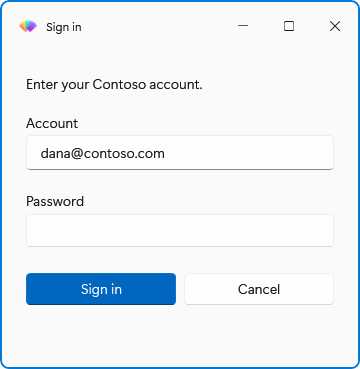
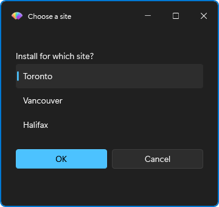

# How to build forms with validation

This guide shows how to collect values from the user with prompts: one value with `Get-FluenceInput`, several with `New-FluencePrompt` and `Show-FluenceDialog`, a choice from a list, and how to make the dialog refuse to close until the input is valid.

## Ask for one value

`Get-FluenceInput` shows a single prompt with OK and Cancel and returns the value, or `$null` on Cancel, Esc, the X or a timeout.

```powershell
$server = Get-FluenceInput -Title 'Connection' -Message 'Server name' -DefaultValue 'localhost'
if ($null -eq $server) { return }
```

Change the control with `-InputType`; for example a number or a password:

```powershell
$port = Get-FluenceInput -Message 'Port' -InputType Number -DefaultValue 443
$secret = Get-FluenceInput -Message 'API key' -InputType Password
```

## Ask for several values

Build one `Fluence.Prompt` per field with `New-FluencePrompt`, then pass the array to `Show-FluenceDialog -Prompts`. Each prompt's `-Name` becomes a property on the result. Prompt and button names must be unique, ignoring case, and cannot be `Cancelled`, `TimedOut` or `PSTypeName`.

```powershell
$prompts = @(
    New-FluencePrompt -Name FullName -Message 'Full name' -ValidateNotEmpty
    New-FluencePrompt -Name Age -Message 'Age' -InputType Number -DefaultValue 30
    New-FluencePrompt -Name Country -Message 'Country' -InputType Choice -ValidateSet 'Australia', 'Canada', 'United Kingdom' -DefaultValue 'Canada'
    New-FluencePrompt -Name StartDate -Message 'Start date' -InputType Date
    New-FluencePrompt -Name AcceptTerms -Message 'I accept the terms and conditions' -InputType Checkbox
)
$result = Show-FluenceDialog -Title 'Registration' -Prompts $prompts -Buttons OK, Cancel

if ($result.Cancelled) { return }
"$($result.FullName), $($result.Age), $($result.Country), $($result.StartDate), $($result.AcceptTerms)"
```



A bare string in `-Prompts` is shorthand for a `Text` prompt whose `Message` is that string. Its `Name` is generated (`Input_` plus eight hex characters), so give a prompt a name with `New-FluencePrompt` when you need to read its value back.

The value type depends on the input type: `Number` gives a `double`, `Date` a `DateTime` or `$null`, `Time` a `TimeSpan` or `$null`, `Checkbox` and `Toggle` a `bool`, a `-MultiSelect` `List` an `object[]`, everything else a string. The full table is in [input types](../reference/input-types.md).

## Require a value

Add `-ValidateNotEmpty`. Clicking a non-cancel button with the field empty (or whitespace) shows an error bar under the prompts and keeps the dialog open.

```powershell
New-FluencePrompt -Name User -Message 'Account' -ValidateNotEmpty
```

Cancel buttons, Esc and the X never run validation, so the user can always leave.

## Match a pattern

Add `-ValidatePattern` with a regular expression. An empty value passes the pattern check, so combine it with `-ValidateNotEmpty` when the field is mandatory.

```powershell
New-FluencePrompt -Name Email -Message 'Work email' -ValidateNotEmpty -ValidatePattern '^[^@\s]+@contoso\.com$'
```

## Validate with your own code

Add `-ValidateScript` with a scriptblock that receives the value and returns `$true` when it is acceptable. An exception inside the block counts as a failure.

```powershell
New-FluencePrompt -Name Port -Message 'Port' -InputType Number -DefaultValue 443 -ValidateScript { param($value) $value -ge 1 -and $value -le 65535 }
```

On a separate module UI runspace (for example `pwsh -MTA`), validators are recreated from text and cannot use caller variables, functions or closures. Keep the block self-contained. An inline STA call preserves the live block.

Validation runs in prompt order and stops at the first failure, so put the cheapest checks first. The message shown is `'<Name>' failed validation.`; use the prompt's `-Name` to make it read well.

## Offer a fixed set of choices

Use `-InputType Choice` with `-ValidateSet`. The default renders a combo box; `-As Radio` renders a column of radio buttons, which suits two to four options.

```powershell
New-FluencePrompt -Name Edition -Message 'Edition' -InputType Choice -ValidateSet 'Standard', 'Professional' -As Radio -DefaultValue 'Standard'
```

## Let the user pick from a list

`-InputType List` renders a list view. Add `-MultiSelect` to allow several selections; the value is then always an array, even for one item.

```powershell
New-FluencePrompt -Name Features -Message 'Features to install' -InputType List -ValidateSet 'Core', 'Documentation', 'Samples' -MultiSelect -DefaultValue 'Core' -ValidateNotEmpty
```

With `-MultiSelect`, `-ValidateNotEmpty` means at least one item.

For a list on its own, `Show-FluenceListSelection` wraps this in a dialog with OK and Cancel and returns the selection or `$null`:

```powershell
$region = Show-FluenceListSelection -Title 'Region' -Message 'Choose the deployment region' -Items 'Europe', 'Americas', 'Asia Pacific' -DefaultValue 'Europe'
$features = Show-FluenceListSelection -Message 'Select the features' -Items 'Core', 'Documentation', 'Samples' -MultiSelect
```



## Collect a file or folder path

`FileOpen`, `FileSave` and `FolderOpen` render a text box with a Browse button that opens the matching Windows picker. The value is the path as a string.

```powershell
$log = Get-FluenceInput -Message 'Log file' -InputType FileSave -DefaultValue "$env:TEMP\install.log"
```

## Collect a password

`-InputType Password` renders the Fluence-styled `PasswordBox` with a reveal button. Its value is a `System.Security.SecureString` by default. Pass it directly to an API accepting SecureString, such as `PSCredential`, and dispose it when done. This avoids a plaintext result by default; it does not protect against code running in the same process or make downstream logging safe.

`-ValidateNotEmpty` checks the secure value's `Length`, so whitespace characters count. A custom `-ValidateScript` receives SecureString: for example, `{ param($value) $value.Length -ge 12 }`. Do not retain or dispose that validator input; the module replaces and disposes it as the field changes. Regex validation requires the explicit `-AsPlainText` option, rather than decrypting a secure value implicitly. A password `-DefaultValue` must be a string and remains plaintext in the specification; omit it when collecting a secret.

```powershell
$result = Show-FluenceDialog -Title 'Sign in' -Prompts @(
    New-FluencePrompt -Name User -Message 'Account' -ValidateNotEmpty
    New-FluencePrompt -Name Pass -Message 'Password' -InputType Password -ValidateNotEmpty
) -Buttons (New-FluenceButton -Text 'Sign in' -Name Login -IsDefault), 'Cancel'

try
{
    if ($result.Login)
    {
        $credential = [System.Management.Automation.PSCredential]::new($result.User, $result.Pass)
        # Use the credential here before disposing its password.
    }
}
finally
{
    if ($result.Pass -is [System.Security.SecureString]) { $result.Pass.Dispose() }
}
```

Even a cancelled `Show-FluenceDialog` result contains its captured values: dispose its password property if you do not use it. `Get-FluenceInput` returns `$null` on cancel/timeout and disposes the discarded secure input itself.

For an API that requires a plain string, opt in and assign the result:

```powershell
$plainSecret = Get-FluenceInput -Message 'API key' -InputType Password -AsPlainText
# Pass the value to the intended API without writing it to the console or a log.
```

The default dialog result view hides prompt values, even with `-AsPlainText`. Explicit property access, `Format-List *`, serialization, and the raw string returned by `Get-FluenceInput -AsPlainText` can still expose them.

## Show a read-only link

`-InputType Link` renders a hyperlink button: `-Message` is the text, `-DefaultValue` the target. It takes no input and returns the URI unchanged.

```powershell
New-FluencePrompt -Name Privacy -Message 'Read the privacy statement' -InputType Link -DefaultValue 'https://contoso.com/privacy'
```

## Read the result

`Show-FluenceDialog` returns a `Fluence.DialogResult` with one property per prompt, one boolean per button, and `Cancelled` and `TimedOut`. Exactly one of a button flag, `Cancelled` or `TimedOut` is true.

```powershell
if ($result.TimedOut) { 'no answer' }
elseif ($result.Cancelled) { 'cancelled' }
elseif ($result.OK) { $result.FullName }
```

Untouched prompts report their `-DefaultValue`, or the type's empty value when there is none (`$null` for text, `0` for a number, `$false` for a check box, `@()` for a multi-select list).

## Related

- [New-FluencePrompt](../reference/New-FluencePrompt.md), [Get-FluenceInput](../reference/Get-FluenceInput.md), [Show-FluenceListSelection](../reference/Show-FluenceListSelection.md)
- [Input types](../reference/input-types.md) for every `-InputType`, its control and its value type
- [Show dialogs and messages](dialogs.md) for buttons, icons, timeouts and placement
- Runnable examples: `Fluence.Wpf.PowerShell.Module/examples/Form.ps1`, `SignIn.ps1`, `ListSelection.ps1`
