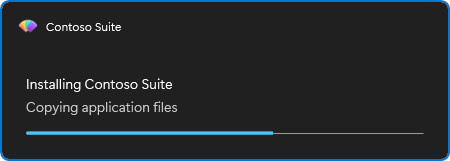

# How to show progress during long work

This guide shows how to open a non-modal progress window, update it while your script works, and close it. The window has a title, a message, an optional detail line and a Fluence `ProgressBar`; the user cannot close it.

## Open, update, close

`Show-FluenceProgress` returns a `Fluence.ProgressHandle` and returns immediately. Pass the handle to `Update-FluenceProgress` and `Close-FluenceProgress`. Put the close in `finally` so an error never leaves the window on screen; closing an already closed handle is a no-op.

```powershell
$progress = Show-FluenceProgress -Title 'Contoso Suite' -Message 'Preparing installation...' -Detail 'This takes a moment.'
try
{
    Install-Prerequisites
    Update-FluenceProgress -Handle $progress -Message 'Installing components' -Detail 'Step 2 of 3'
    Install-Components
    Update-FluenceProgress -Handle $progress -Message 'Configuring' -Detail 'Step 3 of 3'
    Set-Configuration
}
finally
{
    Close-FluenceProgress -Handle $progress
}
```



Only one progress window can be open at a time, and a second `Show-FluenceProgress` throws rather than returning the open handle.

## Show a percentage

The bar is indeterminate until you pass `-PercentComplete`, on `Show-FluenceProgress` or on any update. Values are clamped to 0 to 100. Pass `-Indeterminate` on an update to go back to the animated bar.

```powershell
$files = Get-ChildItem $source -File
for ($i = 0; $i -lt $files.Count; $i++)
{
    Update-FluenceProgress -Handle $progress -Detail $files[$i].Name -PercentComplete (100 * $i / $files.Count)
    Copy-Item $files[$i].FullName $destination
}
Update-FluenceProgress -Handle $progress -Message 'Finishing' -Detail '' -Indeterminate
```

An empty `-Detail` hides the detail line. Parameters you omit keep their current value.

## Keep the window painting on Windows PowerShell

On the default host (Windows PowerShell, or `pwsh` without `-MTA`) the window shares your script's thread. It repaints only when `Show-FluenceProgress` or `Update-FluenceProgress` runs, so a long step with no update leaves the window frozen and it may show as not responding. Call `Update-FluenceProgress` at least every few seconds, even with no new text:

```powershell
$job = Start-Job { Install-LargePackage }
while ($job.State -eq 'Running')
{
    Update-FluenceProgress -Handle $progress
    Start-Sleep -Seconds 2
}
```

On `pwsh -MTA` the window lives on the module's UI runspace and stays responsive between updates without this loop. A supported host calling on its own WPF UI thread uses `Inline`; its existing dispatcher loop keeps the window responsive when the caller yields. Read `$progress.Mode` to see which case applies: `Inline` or `Runspace`.

## Place the window and control stacking

The window is topmost and centred by default, like a deployment progress dialog. Use `-NotTopmost` to let other windows cover it, and `-Position TopRight` or `BottomRight` to keep it out of the way. `-Width` (default 450) sets the width in device-independent pixels.

```powershell
$progress = Show-FluenceProgress -Message 'Installing updates' -Position BottomRight -NotTopmost -Width 400
```

## Show a dialog while progress is open

On `pwsh -MTA` and on a host application you can call `Show-FluenceMessage` or another dialog while the progress window is open; the progress window keeps painting. On the inline host the dialog is modal and the progress window is frozen behind it until the dialog closes.

## Related

- [Show-FluenceProgress](../reference/Show-FluenceProgress.md), [Update-FluenceProgress](../reference/Update-FluenceProgress.md), [Close-FluenceProgress](../reference/Close-FluenceProgress.md)
- [Result objects](../reference/result-objects.md) for `Fluence.ProgressHandle`
- [Explanation](../explanation.md) for the inline, runspace and host threading models
- Runnable example: `Fluence.Wpf.PowerShell.Module/examples/Progress.ps1`
