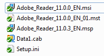

<!-- order:13 -->
### Building an Adobe Reader installation with the PowerShell App Deployment Toolkit

In this example, we will build an Adobe Reader installation which provides the following benefits over using a standard MSI based SCCM deployment:

  - The ability to defer the installation up to 3 times

  - The ability to close any applications that could cause errors during the installation

  - Verification that the required disk space is available

  - Full removal of any previous version of Adobe Reader (to prevent issues sometimes seen when doing an MSI upgrade, i.e. Missing previous installation source files)

  - Installation of any subsequent patches required after the base MSI installation

This example is provided as a script with the toolkit, in the “Examples” folder.

1.  Copy the application source files in to the “Files” directory, e.g.
    
    

2.  Customize the Deploy-Application.ps1 script using the example code below

3.  Install the application by running Deploy-Application.exe

4.  Uninstall the application by running Deploy-Application.exe -DeploymentType "Uninstall"

**Initialization**

```PowerShell
# Populate these variables with the application and script details:

$appVendor = 'Adobe'
$appName = 'Reader'
$appVersion = '11.0.3'
$appArch = ''
$appLang = 'EN'
$appRevision = '01'
$appScriptVersion = '1.0.0'
$appScriptDate = '08/07/2013'
$appScriptAuthor = 'Your Name'
```

**Pre-Install**

```PowerShell
# Prompt the user to close the following applications if they are running and allow the option to defer the installation up to 3 times:
Show-InstallationWelcome -CloseApps 'iexplore,AcroRd32,cidaemon' -AllowDefer -DeferTimes 3

# Show Progress Message (with the default message)
Show-InstallationProgress

# Remove any previous versions of Adobe Reader
Remove-MSIApplications -Name 'Adobe Reader'
```

**Installation**

```PowerShell
# Install the base MSI and apply a transform
Execute-MSI -Action Install -Path 'Adobe\_Reader\_11.0.0\_EN.msi' -Transform 'Adobe\_Reader\_11.0.0\_EN\_01.mst'

# Install the patch
Execute-MSI -Action Patch -Path 'Adobe\_Reader\_11.0.3\_EN.msp'
```

**Post-Installation**

```PowerShell
# No actions required here
```

**Uninstallation**

```PowerShell
# Prompt the user to close the following applications if they are running:
Show-InstallationWelcome -CloseApps 'iexplore,AcroRd32,cidaemon'

# Show Progress Message (with a message to indicate the application is being uninstalled)
Show-InstallationProgress -StatusMessage "Uninstalling Application $installTitle. Please Wait..."

# Remove this version of Adobe Reader
Execute-MSI -Action Uninstall -Path '{AC76BA86-7AD7-1033-7B44-AB0000000001}'
```

