<!-- order:15 -->
### Deploy the Adobe Reader installation using SCCM 2012 Application Model

  - Copy the installation files to a network location accessible by SCCM.

  - Create a new Application and manually specify the application information:

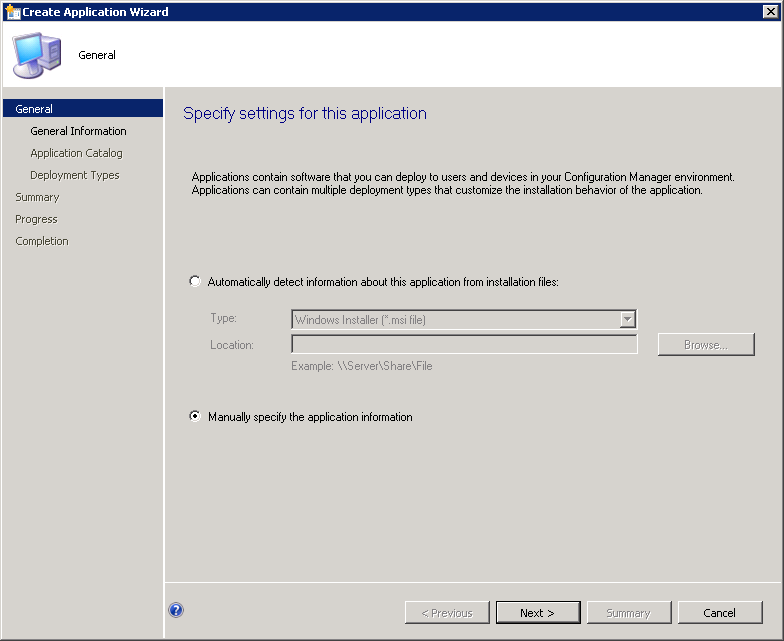

  - Populate the application details accordingly:

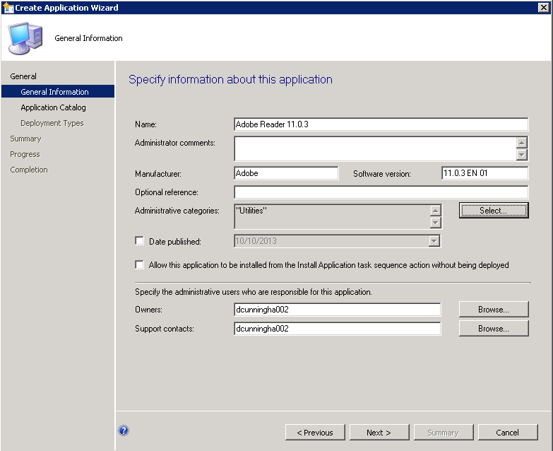

  - Populate the application catalog details if required

  - Add a new Deployment Type and manually specify the deployment type information:

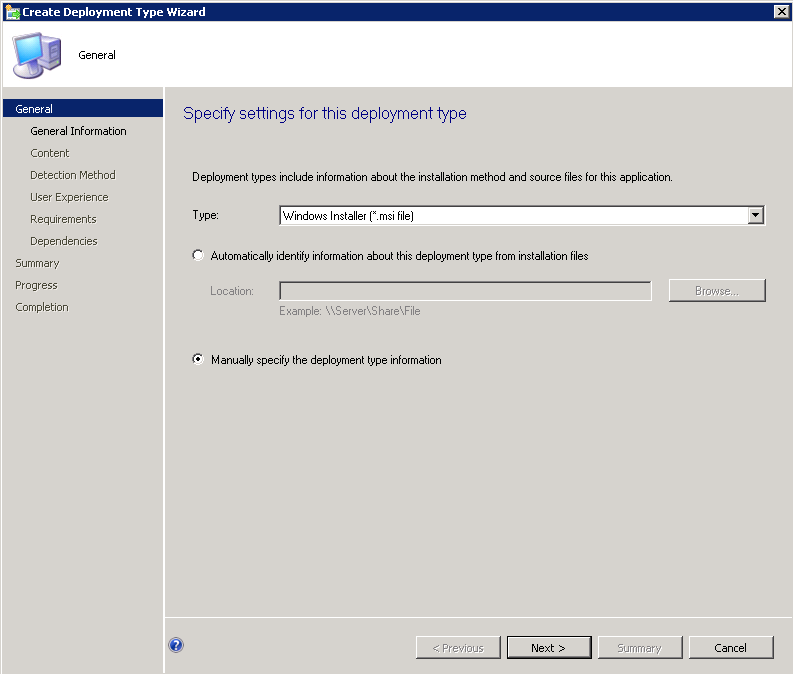

  - Populate the deployment type details accordingly:

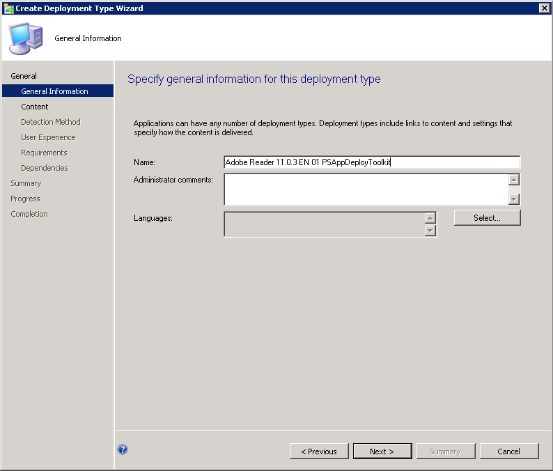

  - Set the content location. Additionally, set the Install and Uninstall programs accordingly. They should be *Deploy-Application.exe -DeploymentType "Install"* and *Deploy-Application.exe -DeploymentType "Uninstall"* respectively:

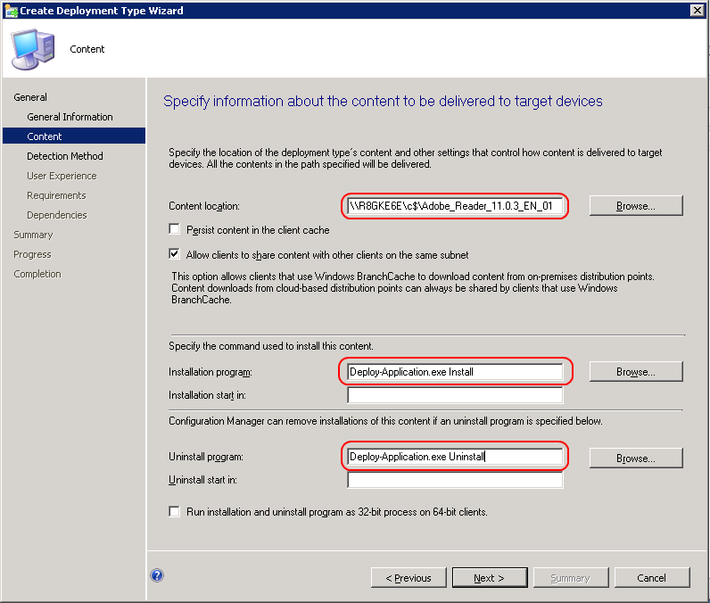

  - Create a new detection rule. Specify the base MSI product code and modify the Version to be the same as the final version after all patches are installed:

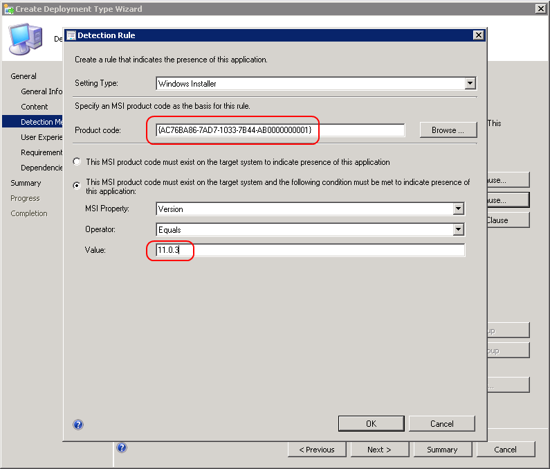

  - On the User Experience page, ensure you use a combination of settings that allows the user to interact with the application. Failure to do so will result in the application installing silently:

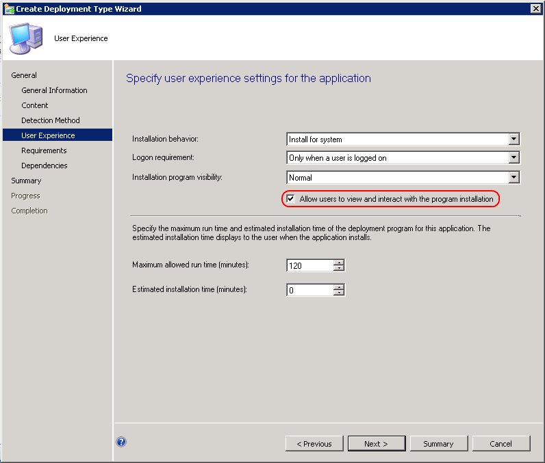

  - Leave the requirements page blank (or modify according to your environment)

  - Leave the software dependencies page blank (or modify according to your environment)

  - Accept the defaults to create the Application

  - Deploy the Application:

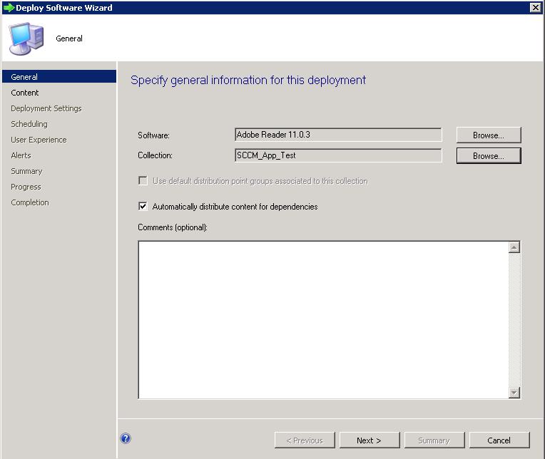

  - Select the relevant Distribution Points:

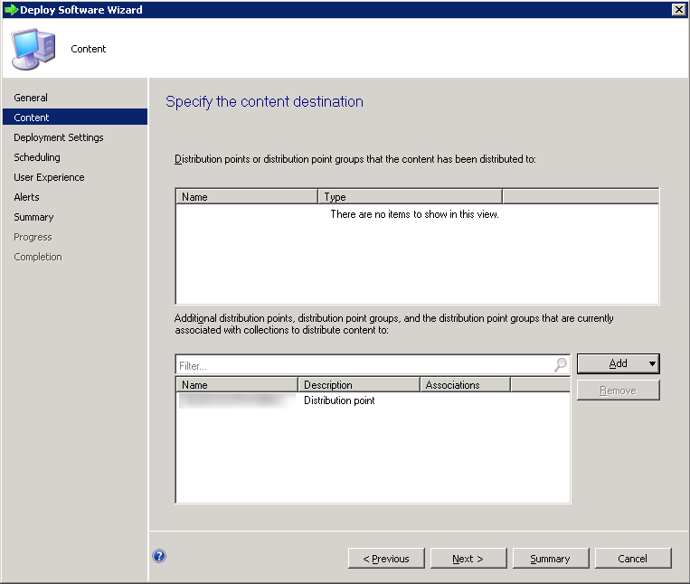

  - Configure deployment settings according to whether it should be a mandatory or app catalogue based deployment:

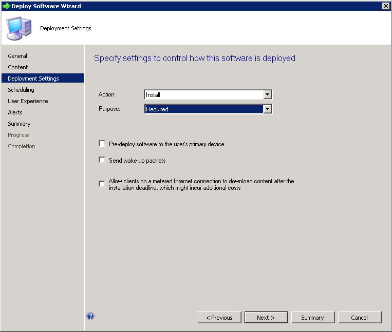

  - Specify the deployment schedule:

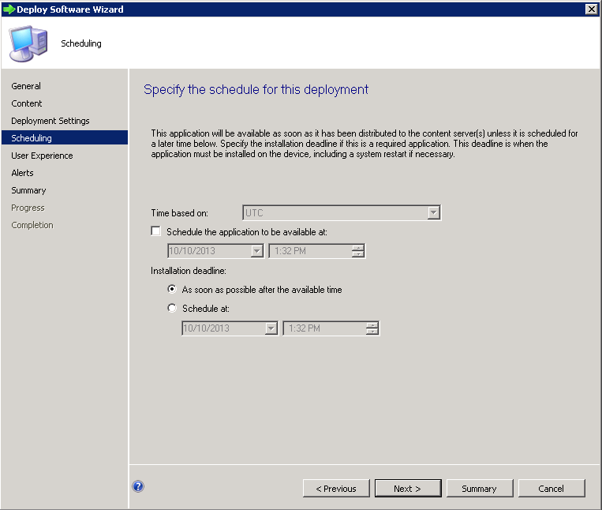

  - Specify User notification settings. In order to prevent excess noise, we recommend only showing notifications for computer restarts:

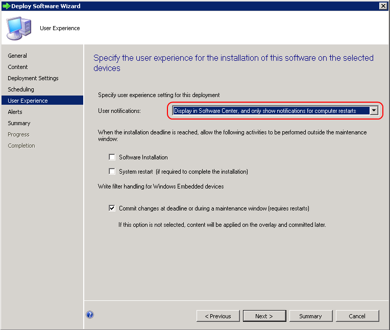

  - Accept the defaults for the rest of the Deployment (or modify according to your environment)

### Important Note regarding deferrals

The SCCM 2012 Application Model does not have the flexibility to schedule Mandatory Assignments on a recurring schedule like SCCM 2007 or SCCM 2012 packages do. Instead, this is determined by the frequency of Software Deployment evaluation cycle in the SCCM Agent Custom Settings. You can modify this to reduce the time from the default of once a day, however this may increase the load on your SCCM servers and clients, and is not configurable on a per application basis:

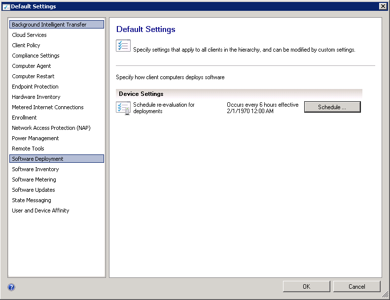
