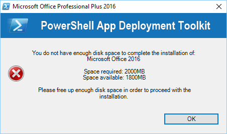

If the CheckDiskSpace parameter is used with the Show-InstallationWelcome function and the disk space requirements are not met, the following prompt will be displayed and the installation will not proceed.

