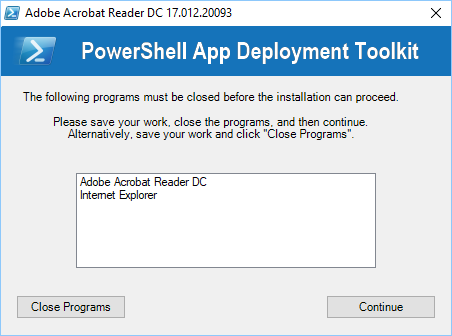
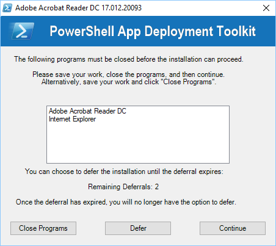
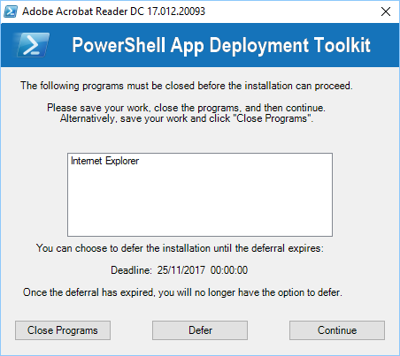
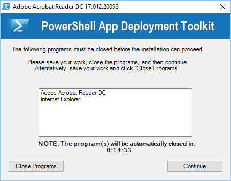
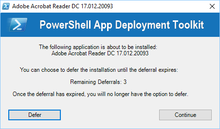

The application welcome prompt can be used to display applications that need to be closed, an option to defer and a countdown to closing applications automatically. Use the “Show-InstallationWelcome” function to display the prompts shown below.

Welcome prompt with close programs option and defer option:

Welcome prompt with close programs options and countdown to automatic closing of applications:

Welcome prompt with just a defer option:

