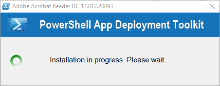
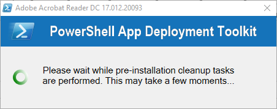
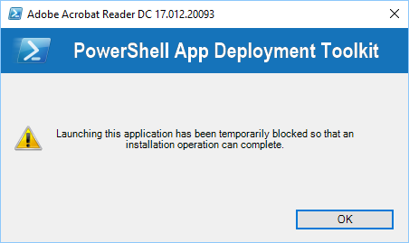
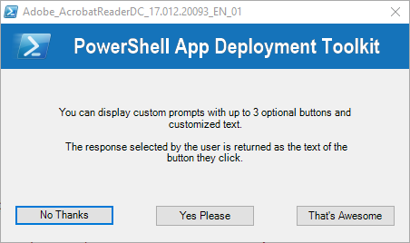
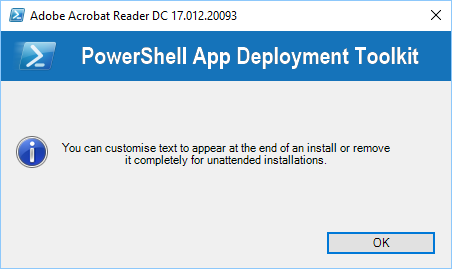
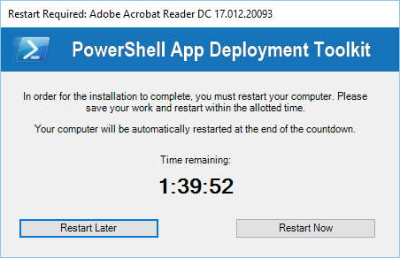
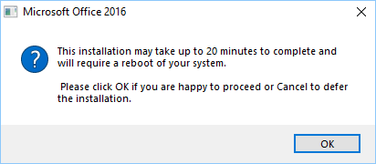
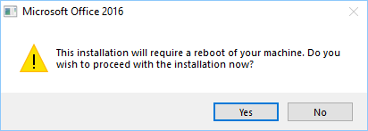

The user interface consists of several components detailed below. The user interface can be branded with a custom logo and banner.

All of the UI components include message text that is customizable in the AppDeployToolkitConfig.xml. The UI has been localised in 11 different languages: English, French, Spanish, Portuguese, German, Italian, Dutch, Swedish, Danish, Norweigan and Japanese. Additional languages can be easily added in the XML configuration file.

The language used by the Toolkit UI is selected automatically based on the language culture of the operating system, so the same AppDeployToolkitConfig file can be used in a multi-language environment.

The user interface can be suppressed by specifying the deploy mode parameter as follows:

**Deploy-Application.ps1 -DeployMode "Silent"**

### Installation Progress

The installation progress message displays an indeterminate progress ring to indicate an installation is in progress and display status messages to the end user. This is invoked using the “Show-InstallationProgress” function.

The progress message can be dynamically updated to indicate the stage of the installation or to display custom messages to the user, using the “Show-InstallationProgress” function.

### Installation Welcome Prompt

The application welcome prompt can be used to display applications that need to be closed, an option to defer and a countdown to closing applications automatically. Use the “Show-InstallationWelcome” function to display the prompts shown below.

Welcome prompt with close programs option and defer option:

Welcome prompt with close programs options and countdown to automatic closing of applications:

Welcome prompt with just a defer option:

### Block Application Execution

If the block execution option is enabled (see Show-InstallationWelcome function), the user will be prompted that they cannot launch the specified application(s) while the installation is in progress. The application will be unblocked again once the installation has completed.

### Disk Space Requirements

If the CheckDiskSpace parameter is used with the Show-InstallationWelcome function and the disk space requirements are not met, the following prompt will be displayed and the installation will not proceed.

### Custom Installation Prompt 

A custom prompt with the toolkit branding can be used to display messages and interact with the user using the “Show-InstallationPrompt” function. The title and text is customizable and up to 3 customizable buttons can be included on the prompt as well as optional system icons, e.g.

Additionally, the prompt can be displayed asynchronously, e.g. to display a message at the end of the installation but allow the installation to return the exit code to the parent process without waiting for the user to respond to the message.

### Installation Restart Prompt

A restart prompt can be displayed with a countdown to automatic restart using the “Show-InstallationRestartPrompt”. Since the restart prompt is executed in a separate PowerShell session, the toolkit will still return the appropriate exit code to the parent process.

### Balloon tip notifications

Balloon tip notifications are displayed in the system tray automatically at the beginning and end of the installation. These can be turned off in the XML configuration.

### Custom Dialog box

A generic dialog box to display custom messages to the user without the toolkit branding using the function “Show-DialogBox”. This can be customized with different system icons and buttons.

